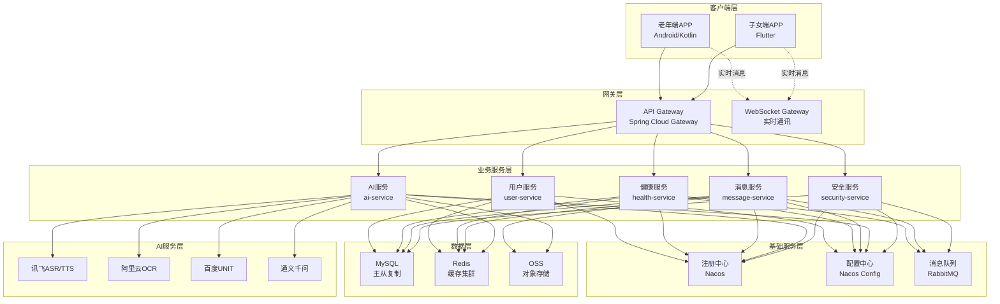
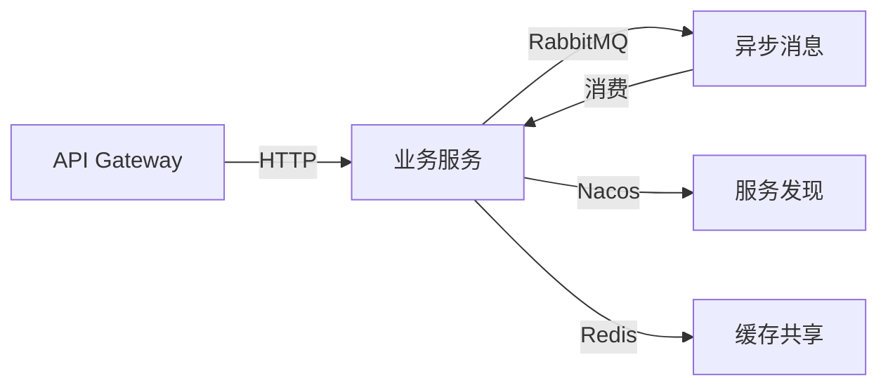

# 银龄守候·双模交互版

> 一款面向老年人的智能陪伴与健康管理应用  
> 基于语音交互与AI陪伴的新一代养老关怀平台

---

## 🎉 骨架代码完成

✅ **项目完成度: 50%** (骨架代码阶段完成)

本项目已完成以下工作：

- ✅ **完整的文档** (13 个详细文档)
- ✅ **基础设施** (Docker, CI/CD, 数据库脚本)
- ✅ **后端骨架** (7 个微服务，56 个 Java 文件)
- ✅ **Android 骨架** (现代 Jetpack Compose，12 个 Kotlin 文件)
- ✅ **Flutter 骨架** (Riverpod 状态管理，15 个 Dart 文件)

**立即开始？** [📖 查看快速启动指南](#4-快速开始)

---

## 目录

- [1. 项目简介](#1-项目简介)
- [2. 核心特性](#2-核心特性)
- [3. 技术架构](#3-技术架构)
- [4. 快速开始](#4-快速开始)
- [5. 项目结构](#5-项目结构)
- [6. 文档导航](#6-文档导航)
- [7. 开发指南](#7-开发指南)
- [8. 部署说明](#8-部署说明)
- [9. 联系我们](#9-联系我们)

---

## 1. 项目简介

### 1.1 项目背景

随着中国老龄化社会的到来，截至2024年，我国60岁及以上老年人口已超过2.8亿，占总人口的19.8%。大量独居、空巢老年人面临着健康管理困难、情感孤独、安全隐患等问题。而子女因工作繁忙，难以时刻陪伴在父母身边，这种"空间上的分离，情感上的牵挂"成为当代社会的普遍痛点。

**银龄守候·双模交互版**应运而生，旨在通过AI技术和移动互联网，为老年人提供智能陪伴与健康管理服务，同时帮助子女远程关怀父母，构建"虚拟陪伴+远程守护"的新型养老模式。

### 1.2 核心理念

#### 🎯 双模交互

- **语音优先**：为老年人提供自然的语音交互体验，降低使用门槛
- **触控辅助**：大字体、大按钮、极简界面，适配老年人使用习惯

#### 🤖 AI陪伴

- **智能对话**：基于大语言模型的自然对话，提供情感陪伴
- **主动关怀**：AI助手会主动询问健康状况、提醒用药、播报天气

#### 👨‍👩‍👦 家庭连接

- **实时守护**：子女可随时查看父母健康数据、位置信息
- **远程交互**：语音留言、视频通话、健康报告分享

#### 🛡️ 安全防护

- **跌倒检测**：利用手机传感器检测跌倒事件，及时预警
- **电子围栏**：超出安全区域自动通知家人
- **紧急求助**：一键SOS，快速联系紧急联系人

### 1.3 目标用户

#### 老年端用户

- **年龄段**：60-80岁
- **特征**：独居/空巢老人，对智能手机使用不熟练
- **痛点**：
  - 健康管理困难（忘记吃药、不懂看体检报告）
  - 情感孤独（子女不在身边）
  - 安全隐患（跌倒、走失风险）
  - 操作复杂（传统APP难以使用）

#### 子女端用户

- **年龄段**：30-55岁
- **特征**：工作繁忙，无法时刻陪伴父母
- **痛点**：
  - 担心父母健康状况
  - 无法及时了解父母动态
  - 希望远程关怀但缺乏工具

### 1.4 项目价值

#### 社会价值

- ✅ 缓解老龄化社会的养老压力
- ✅ 提升老年人生活质量和幸福感
- ✅ 减少老年人意外事故发生率
- ✅ 促进家庭成员之间的情感连接

#### 商业价值

- 💰 **市场规模**：中国养老产业规模超过10万亿元
- 📈 **增长潜力**：智慧养老市场年增长率超过30%
- 🎯 **目标市场**：2.8亿老年人口，8000万独居老人
- 💡 **变现模式**：
  - 基础功能免费
  - 高级功能订阅（健康报告、AI陪伴时长）
  - 企业服务（养老机构、社区服务）

### 1.5 项目定位

**银龄守候**不是一个简单的健康管理APP，而是一个**以AI陪伴为核心、以健康管理为基础、以安全防护为保障**的综合性养老关怀平台。

| 维度 | 传统养老APP | 银龄守候 |
|:-----|:-----------|:---------|
| **交互方式** | 触控为主 | 语音+触控双模式 |
| **功能定位** | 工具性 | 陪伴性+工具性 |
| **用户体验** | 复杂操作 | 极简设计，0学习成本 |
| **AI能力** | 简单语音识别 | 大模型对话+情感陪伴 |
| **家庭连接** | 单向查看 | 双向互动+实时守护 |
| **安全保障** | 被动记录 | 主动预警+紧急响应 |

## 2. 核心特性

### 2.1 智能语音交互 🎤

#### 语音识别（ASR）

- **流式识别**：实时语音转文字，低延迟响应
- **方言支持**：支持四川话、粤语、上海话、东北话、河南话
- **降噪处理**：自动过滤环境噪音，提高识别准确率
- **VAD检测**：智能检测有效语音段，节省识别成本

#### 语音合成（TTS）

- **多种音色**：温柔女声、活泼女声、沉稳男声等5种音色
- **情感控制**：支持高兴、难过、温柔等6种情感表达
- **SSML标记**：精确控制语速、停顿、重音
- **智能播报**：自动识别并优化数字、日期、专业术语的播报

#### 对话管理

- **多轮对话**：支持上下文理解，自然连贯的对话体验
- **意图识别**：准确理解用户需求（设置提醒、查询健康、拨打电话等）
- **槽位填充**：引导式信息补全，降低输入难度
- **情感分析**：实时识别用户情绪，提供针对性回应

### 2.2 AI智能陪伴 🤖

#### 虚拟陪伴助手

- **个性化形象**：Lottie动画打造的可爱AI形象
- **主动关怀**：
  - 早晨问候："张爷爷早上好，今天天气不错，记得出去散散步哦"
  - 用药提醒："该吃降压药啦，记得饭后服用"
  - 健康关注："您今天还没记录血压呢，要不要测一下？"
- **陪伴聊天**：
  - 天气查询、新闻播报、讲笑话
  - 情感倾诉、生活建议
  - 健康咨询、用药指导

#### 智能推荐

- **健康建议**：根据健康数据给出个性化建议
- **运动推荐**：适合老年人的运动方案
- **饮食指导**：营养搭配建议
- **就医提醒**：异常数据及时提醒就医

### 2.3 健康管理 💊

#### 药品管理

- **OCR识别**：拍照识别药品包装，自动录入药品信息
- **用药提醒**：
  - 多种提醒方式：推送通知、语音播报、震动提醒
  - 灵活设置：每天/按周/间隔天数/按需
  - 家人通知：用药后自动通知家人
- **用药记录**：
  - 自动记录服药情况
  - 统计用药依从性
  - 生成用药报告

#### 健康数据记录

- **多类型数据**：血压、血糖、心率、体重、体温、血氧饱和度
- **多种录入方式**：
  - 语音录入："今天血压135/85"
  - 手动输入
  - 设备同步（智能手环、血压计）
- **异常预警**：
  - 实时检测异常数据
  - 分级预警（轻微/中度/严重）
  - 自动通知家人

#### 健康报告

- **周报/月报**：自动生成健康趋势分析
- **可视化图表**：直观展示健康数据变化
- **专业建议**：基于AI的健康评估和建议
- **一键分享**：报告分享给子女或医生

### 2.4 消息通讯 💬

#### 语音留言

- **一键录制**：长按录制，松手发送
- **自动转文字**：语音留言自动转写为文字
- **播放提醒**：未播放留言持续提醒

#### 视频通话

- **高清视频**：基于WebRTC的稳定通话
- **网络自适应**：根据网络状况自动调整清晰度
- **美颜滤镜**：可选美颜效果
- **录像功能**：珍贵时刻可录制保存

#### 实时消息

- **WebSocket长连接**：消息实时送达
- **已读回执**：查看消息是否已读
- **多端同步**：手机、平板消息实时同步

### 2.5 安全防护 🛡️

#### 跌倒检测

- **传感器融合**：加速度计+陀螺仪多传感器检测
- **智能算法**：机器学习模型，准确识别跌倒动作
- **二次确认**：检测到跌倒后，30秒倒计时确认
- **自动求助**：无响应自动拨打紧急联系人

#### 电子围栏

- **多种围栏**：圆形围栏、多边形围栏
- **双向预警**：进入预警、离开预警
- **时段控制**：可设置生效时间段
- **多人通知**：同时通知多个家庭成员

#### 位置追踪

- **实时定位**：GPS+网络定位双重保障
- **轨迹回放**：查看历史移动轨迹
- **电量监控**：低电量自动提醒
- **隐私保护**：老人可随时关闭位置共享

#### 紧急求助

- **一键SOS**：主界面显眼位置，紧急情况一键触发
- **自动拨号**：依次拨打紧急联系人
- **位置发送**：自动发送当前位置给家人
- **语音通知**："我遇到紧急情况，请尽快联系我"

### 2.6 子女端功能 📱

#### 实时监控

- **健康数据仪表盘**：父母健康状况一目了然
- **异常提醒**：健康数据异常即时推送
- **位置查看**：随时了解父母位置
- **活跃度统计**：查看父母日常活跃情况

#### 远程关怀

- **用药提醒设置**：远程为父母设置用药提醒
- **健康报告查看**：查看父母健康趋势报告
- **视频通话**：随时发起视频通话
- **语音留言**：发送语音消息给父母

#### 安全管理

- **电子围栏设置**：设置父母活动安全区域
- **跌倒检测开关**：管理跌倒检测功能
- **紧急联系人管理**：设置和修改紧急联系人
- **历史轨迹查看**：回放父母移动路径

### 2.7 技术亮点 ⚡

#### 零学习成本

- **大字体**：所有文字均采用超大字体（24sp+）
- **大按钮**：主功能按钮高度150dp+，易于点击
- **语音优先**：所有操作均可通过语音完成
- **极简界面**：主界面仅4个大按钮，减少选择困难

#### 低成本运营

- **智能缓存**：
  - ASR结果缓存24小时，重复识别不计费
  - OCR结果缓存7天，相同药品识别不计费
  - TTS音频缓存，相同文本不重复合成
- **降级策略**：
  - AI服务异常时自动切换备用服务
  - 网络不佳时启用离线功能
- **成本预估**：
  - 单用户月均AI成本：¥15-25
  - MVP阶段月运营成本：¥700（100用户）

#### 性能优化

- **秒级响应**：语音识别延迟<500ms
- **流畅体验**：界面帧率≥60fps
- **低功耗**：优化后台服务，续航延长30%
- **离线可用**：核心功能支持离线使用

## 3. 技术架构

### 3.1 整体架构



### 3.2 技术栈

#### 老年端APP（Android）

| 技术 | 版本 | 用途 |
|:-----|:-----|:-----|
| **Kotlin** | 1.9.20 | 主要开发语言 |
| **Jetpack Compose** | 2024.02.00 | 声明式UI框架 |
| **Hilt** | 2.48 | 依赖注入 |
| **Room** | 2.6.1 | 本地数据库 |
| **Retrofit** | 2.9.0 | 网络请求 |
| **OkHttp** | 4.12.0 | HTTP客户端 |
| **Coil** | 2.5.0 | 图片加载 |
| **Lottie** | 6.2.0 | 动画效果 |
| **CameraX** | 1.3.1 | 相机功能 |
| **WorkManager** | 2.9.0 | 后台任务 |
| **DataStore** | 1.0.0 | 数据持久化 |

#### 子女端APP（Flutter）

| 技术 | 版本 | 用途 |
|:-----|:-----|:-----|
| **Flutter** | 3.16+ | 跨平台框架 |
| **Riverpod** | 2.4.9 | 状态管理 |
| **Dio** | 5.4.0 | 网络请求 |
| **Flutter Hooks** | 0.20.4 | 状态钩子 |
| **Go Router** | 13.0.0 | 路由管理 |
| **Freezed** | 2.4.6 | 不可变对象 |
| **Flutter WebRTC** | 0.9.48 | 视频通话 |
| **FL Chart** | 0.66.0 | 图表展示 |

#### 后端服务

| 技术 | 版本 | 用途 |
|:-----|:-----|:-----|
| **Spring Boot** | 3.2.1 | 服务框架 |
| **Spring Cloud Alibaba** | 2022.0.0.0 | 微服务生态 |
| **Spring Cloud Gateway** | 4.1.0 | API网关 |
| **Nacos** | 2.3.0 | 注册/配置中心 |
| **RabbitMQ** | 3.12.10 | 消息队列 |
| **MySQL** | 8.0+ | 关系型数据库 |
| **Redis** | 7.2+ | 缓存数据库 |
| **MyBatis-Plus** | 3.5.5 | ORM框架 |
| **Redisson** | 3.25.2 | 分布式锁 |
| **JWT** | 0.12.3 | Token认证 |
| **Knife4j** | 4.4.0 | API文档 |

#### AI服务

| 服务商 | 服务 | 费用 | 用途 |
|:------|:-----|:-----|:-----|
| **讯飞** | 语音识别（ASR） | ¥0.02/次 | 语音转文字 |
| **讯飞** | 语音合成（TTS） | ¥0.015/次 | 文字转语音 |
| **阿里云** | 文字识别（OCR） | ¥0.03/次 | 药品识别 |
| **百度** | 自然语言处理（UNIT） | ¥0.01/次 | 意图理解 |
| **通义千问** | 大语言模型（LLM） | ¥0.002/token | AI对话 |

#### 基础设施

| 技术 | 版本 | 用途 |
|:-----|:-----|:-----|
| **Docker** | 24.0+ | 容器化 |
| **Docker Compose** | 2.23+ | 容器编排 |
| **Kubernetes** | 1.28+ | 生产环境编排（可选） |
| **阿里云OSS** | - | 对象存储 |
| **极光推送** | - | 消息推送 |
| **高德地图** | - | 地图定位 |

### 3.3 数据库设计

#### 分库策略

```
yinling_guardian_main（主库）
├── 用户模块表
├── 系统配置表
└── 字典表

yinling_guardian_health（健康库）
├── 健康数据表
└── 药品管理表

yinling_guardian_message（消息库）
├── 消息记录表
└── 通话记录表

yinling_guardian_security（安全库）
├── 安全事件表
└── 日志表

yinling_guardian_ai（AI库）
├── AI服务日志表
└── 对话记录表
```

#### 分表策略

| 表名 | 分表方式 | 数量 | 路由规则 |
|:-----|:---------|:-----|:---------|
| `health_data_*` | 按用户ID | 16张 | user_id % 16 |
| `msg_record_*` | 按月 | 12张/年 | YYYYMM |
| `call_record_*` | 按月 | 12张/年 | YYYYMM |
| `ai_log_*` | 按月 | 12张/年 | YYYYMM |

#### 核心表设计

- **用户相关**：user, family_member, user_setting, contact
- **健康管理**：medication, medication_reminder, health_data, health_report
- **消息通讯**：msg_record, call_record, voice_message, push_message
- **安全防护**：security_event, location_history, geofence, emergency_contact

详细设计见：[数据库设计文档](docs/03-接口文档/05-数据库设计.md)

### 3.4 微服务架构

#### 服务拆分

| 服务名 | 端口 | 职责 |
|:------|:-----|:-----|
| **gateway-service** | 8080 | API网关，路由转发、鉴权 |
| **user-service** | 8081 | 用户管理、家庭管理、认证授权 |
| **health-service** | 8082 | 健康数据、药品管理、用药提醒 |
| **message-service** | 8083 | 消息、通话、推送 |
| **security-service** | 8084 | 安全事件、位置追踪、围栏管理 |
| **ai-service** | 8085 | AI服务集成、对话管理 |
| **scheduler-service** | 8086 | 定时任务、报表生成 |

#### 服务通信



- **同步调用**：基于Feign的HTTP调用，用于实时性要求高的场景
- **异步消息**：基于RabbitMQ的消息队列，用于解耦和削峰填谷
- **服务发现**：基于Nacos的服务注册与发现
- **配置管理**：基于Nacos Config的集中配置

### 3.5 安全设计

#### 认证授权

- **JWT Token**：无状态认证，Token有效期2小时
- **Refresh Token**：刷新Token，有效期7天
- **权限控制**：基于RBAC的角色权限模型

#### 数据安全

- **传输加密**：全站HTTPS，TLS 1.3
- **存储加密**：敏感信息（身份证、手机号）AES-256加密
- **密码安全**：BCrypt加密，加盐哈希

#### 接口安全

- **签名验证**：关键接口添加签名校验
- **防重放攻击**：基于时间戳+nonce的防重放机制
- **限流保护**：基于Redis的分布式限流
- **黑白名单**：IP黑白名单管理

### 3.6 性能优化

#### 缓存策略

```
三级缓存架构：
┌─────────────┐
│ 本地缓存    │ ← Caffeine（热点数据）
│ (L1 Cache)  │
└─────────────┘
       ↓
┌─────────────┐
│ Redis缓存   │ ← Redis（分布式缓存）
│ (L2 Cache)  │
└─────────────┘
       ↓
┌─────────────┐
│ MySQL数据库 │ ← 持久化存储
│ (Database)  │
└─────────────┘
```

#### 读写分离

- **主库**：承担所有写操作
- **从库1**：业务查询
- **从库2**：报表统计

#### 连接池优化

```yaml
HikariCP配置：
- minimum-idle: 10
- maximum-pool-size: 50
- connection-timeout: 30s
- idle-timeout: 10min
- max-lifetime: 30min
```

## 4. 快速开始

### 4.1 环境要求

#### 开发环境

| 工具 | 版本要求 | 说明 |
|:-----|:---------|:-----|
| **JDK** | 17+ | 后端开发 |
| **Maven** | 3.8+ | 依赖管理 |
| **Node.js** | 18+ | 前端工具链 |
| **MySQL** | 8.0+ | 数据库 |
| **Redis** | 7.0+ | 缓存 |
| **RabbitMQ** | 3.12+ | 消息队列 |
| **Docker** | 24.0+ | 容器化（可选） |
| **Android Studio** | 2023.1+ | Android开发 |
| **Flutter SDK** | 3.16+ | Flutter开发 |

#### 第三方服务

- 讯飞开放平台账号（语音识别/合成）
- 阿里云账号（OCR、OSS）
- 百度AI平台账号（自然语言处理）
- 阿里云通义千问API Key（大语言模型）
- 极光推送账号（消息推送）
- 高德地图API Key（地图定位）

### 4.2 本地开发环境搭建

#### 步骤1：克隆代码

```bash
git clone https://github.com/your-org/yinling-guardian.git
cd yinling-guardian
```

#### 步骤2：启动基础服务（Docker Compose）

```bash
# 启动MySQL、Redis、RabbitMQ、Nacos
cd docker
docker-compose up -d

# 检查服务状态
docker-compose ps
```

**服务访问地址**：

- MySQL: `localhost:3306`
- Redis: `localhost:6379`
- RabbitMQ: `http://localhost:15672` (用户名/密码: admin/admin)
- Nacos: `http://localhost:8848/nacos` (用户名/密码: nacos/nacos)

#### 步骤3：初始化数据库

```bash
# 执行数据库初始化脚本
mysql -h localhost -u root -p < scripts/init-database.sql

# 导入测试数据（可选）
mysql -h localhost -u root -p < scripts/test-data.sql
```

#### 步骤4：配置后端服务

修改配置文件：`backend/*/src/main/resources/application-dev.yml`

```yaml
spring:
  datasource:
    url: jdbc:mysql://localhost:3306/yinling_guardian_main
    username: root
    password: your_password
  redis:
    host: localhost
    port: 6379
  rabbitmq:
    host: localhost
    port: 5672
    username: admin
    password: admin

# AI服务配置
ai:
  xunfei:
    app-id: your_xunfei_app_id
    api-key: your_xunfei_api_key
    api-secret: your_xunfei_api_secret
  aliyun:
    access-key-id: your_aliyun_access_key
    access-key-secret: your_aliyun_access_secret
  baidu:
    api-key: your_baidu_api_key
    secret-key: your_baidu_secret_key
  qwen:
    api-key: your_qwen_api_key
```

#### 步骤5：启动后端服务

```bash
cd backend

# 启动网关服务
cd gateway-service
mvn spring-boot:run

# 启动用户服务
cd ../user-service
mvn spring-boot:run

# 启动健康服务
cd ../health-service
mvn spring-boot:run

# 启动消息服务
cd ../message-service
mvn spring-boot:run

# 启动AI服务
cd ../ai-service
mvn spring-boot:run

# 启动安全服务
cd ../security-service
mvn spring-boot:run
```

**服务启动顺序**：

1. Nacos（注册中心）
2. gateway-service（网关）
3. 其他业务服务（顺序无关）

**验证服务启动**：

- 访问 Nacos 控制台：`http://localhost:8848/nacos`
- 查看服务列表，确认所有服务已注册
- 访问 API 文档：`http://localhost:8080/doc.html`

#### 步骤6：启动老年端APP（Android）

```bash
cd android-elderly-app

# 安装依赖
./gradlew build

# 修改配置
# 编辑 app/src/main/java/com/yinling/config/AppConfig.kt
# 将 BASE_URL 改为本地地址：http://10.0.2.2:8080

# 运行APP（连接真机或启动模拟器）
./gradlew installDebug
```

或在 Android Studio 中：

1. 打开 `android-elderly-app` 项目
2. 等待 Gradle 同步完成
3. 点击 Run 按钮（绿色三角形）

#### 步骤7：启动子女端APP（Flutter）

```bash
cd flutter-family-app

# 安装依赖
flutter pub get

# 修改配置
# 编辑 lib/config/app_config.dart
# 将 baseUrl 改为本地地址

# 运行APP
flutter run
```

或在 Android Studio / VS Code 中：

1. 打开 `flutter-family-app` 项目
2. 运行 `flutter pub get`
3. 按 F5 或点击 Run 按钮

### 4.3 使用Docker Compose一键启动

```bash
# 启动所有服务（包括前端和后端）
docker-compose -f docker-compose.full.yml up -d

# 查看日志
docker-compose -f docker-compose.full.yml logs -f

# 停止所有服务
docker-compose -f docker-compose.full.yml down
```

**访问地址**：

- API Gateway: `http://localhost:8080`
- API文档: `http://localhost:8080/doc.html`
- Nacos: `http://localhost:8848/nacos`
- RabbitMQ: `http://localhost:15672`

### 4.4 测试账号

开发环境已预置测试账号：

#### 老年端用户

```
手机号：13800138001
密码：123456
角色：老年人（张爷爷）
```

#### 子女端用户

```
手机号：13800138002
密码：123456
角色：子女（张明）
```

**家庭关系**：张明是张爷爷的儿子

### 4.5 常见问题

#### Q1：Nacos服务注册失败

```bash
# 检查Nacos是否启动
docker ps | grep nacos

# 查看Nacos日志
docker logs nacos

# 重启Nacos
docker restart nacos
```

#### Q2：MySQL连接失败

```bash
# 检查MySQL是否启动
docker ps | grep mysql

# 测试连接
mysql -h localhost -u root -p

# 检查端口占用
netstat -ano | findstr 3306  # Windows
lsof -i:3306                 # Linux/Mac
```

#### Q3：Redis连接失败

```bash
# 检查Redis是否启动
docker ps | grep redis

# 测试连接
redis-cli ping

# 应返回：PONG
```

#### Q4：Android APP连接后端失败

- 确认手机和电脑在同一局域网
- 使用 `ipconfig` (Windows) 或 `ifconfig` (Mac/Linux) 查看电脑IP
- 将 `BASE_URL` 修改为电脑IP，例如：`http://192.168.1.100:8080`
- 如果使用模拟器，使用 `http://10.0.2.2:8080`（Android模拟器特殊IP）

#### Q5：AI服务调用失败

- 检查AI服务配置是否正确
- 确认API Key是否有效
- 查看AI服务余额是否充足
- 检查网络是否能访问第三方AI服务

## 5. 项目结构

### 5.1 整体目录结构

```
yinling-guardian/
├── android-elderly-app/          # 老年端Android APP
├── flutter-family-app/           # 子女端Flutter APP
├── backend/                      # 后端微服务
│   ├── gateway-service/          # API网关
│   ├── user-service/             # 用户服务
│   ├── health-service/           # 健康服务
│   ├── message-service/          # 消息服务
│   ├── security-service/         # 安全服务
│   ├── ai-service/              # AI服务
│   ├── scheduler-service/        # 定时任务服务
│   └── common/                   # 公共模块
├── docs/                         # 项目文档
│   ├── 01-总览文档/
│   ├── 02-模块设计/
│   └── 03-接口文档/
├── docker/                       # Docker配置
│   ├── docker-compose.yml        # 基础服务
│   └── docker-compose.full.yml  # 完整服务
├── scripts/                      # 脚本文件
│   ├── init-database.sql         # 数据库初始化
│   └── deploy.sh                 # 部署脚本
└── README.md                     # 项目说明
```

### 5.2 老年端APP结构

```
android-elderly-app/
├── app/
│   ├── src/
│   │   ├── main/
│   │   │   ├── java/com/yinling/elderly/
│   │   │   │   ├── ui/                    # UI层
│   │   │   │   │   ├── home/              # 首页
│   │   │   │   │   ├── health/            # 健康管理
│   │   │   │   │   ├── message/           # 消息通讯
│   │   │   │   │   ├── ai/                # AI陪伴
│   │   │   │   │   └── setting/           # 设置
│   │   │   │   ├── viewmodel/             # ViewModel层
│   │   │   │   ├── data/                  # 数据层
│   │   │   │   │   ├── repository/        # 数据仓库
│   │   │   │   │   ├── local/             # 本地数据源
│   │   │   │   │   └── remote/            # 远程数据源
│   │   │   │   ├── domain/                # 领域层
│   │   │   │   │   ├── model/             # 领域模型
│   │   │   │   │   └── usecase/           # 用例
│   │   │   │   ├── service/               # 服务
│   │   │   │   │   ├── VoiceService.kt    # 语音服务
│   │   │   │   │   ├── LocationService.kt # 定位服务
│   │   │   │   │   └── FallDetectionService.kt # 跌倒检测
│   │   │   │   ├── di/                    # 依赖注入
│   │   │   │   └── util/                  # 工具类
│   │   │   ├── res/                       # 资源文件
│   │   │   │   ├── layout/                # 布局文件（Compose无需）
│   │   │   │   ├── values/                # 配置文件
│   │   │   │   ├── drawable/              # 图片资源
│   │   │   │   └── raw/                   # Lottie动画
│   │   │   └── AndroidManifest.xml        # 清单文件
│   │   └── test/                          # 单元测试
│   └── build.gradle.kts                   # 构建配置
└── gradle/                                # Gradle配置
```

**架构模式**：MVVM + Clean Architecture

- **UI层**：Jetpack Compose声明式UI
- **ViewModel层**：处理UI逻辑，持有UI状态
- **Domain层**：业务逻辑，独立于框架
- **Data层**：数据处理，Repository模式

### 5.3 子女端APP结构

```
flutter-family-app/
├── lib/
│   ├── main.dart                          # 应用入口
│   ├── app.dart                           # App配置
│   ├── features/                          # 功能模块
│   │   ├── auth/                          # 认证
│   │   │   ├── presentation/              # 展示层
│   │   │   ├── domain/                    # 领域层
│   │   │   └── data/                      # 数据层
│   │   ├── dashboard/                     # 仪表盘
│   │   ├── health/                        # 健康管理
│   │   ├── message/                       # 消息通讯
│   │   └── security/                      # 安全管理
│   ├── core/                              # 核心模块
│   │   ├── network/                       # 网络请求
│   │   ├── storage/                       # 本地存储
│   │   ├── theme/                         # 主题配置
│   │   └── utils/                         # 工具类
│   ├── shared/                            # 共享组件
│   │   ├── widgets/                       # 通用组件
│   │   └── models/                        # 共享模型
│   └── config/                            # 配置文件
│       ├── app_config.dart                # 应用配置
│       └── routes.dart                    # 路由配置
├── assets/                                # 资源文件
│   ├── images/                            # 图片
│   ├── fonts/                             # 字体
│   └── lottie/                            # 动画
├── test/                                  # 单元测试
├── pubspec.yaml                           # 依赖配置
└── analysis_options.yaml                  # 代码分析配置
```

**架构模式**：Feature-First + Clean Architecture

- **Presentation层**：UI组件和状态管理（Riverpod）
- **Domain层**：业务逻辑和用例
- **Data层**：数据访问和仓库实现

### 5.4 后端服务结构

```
backend/
├── gateway-service/                       # API网关
│   ├── src/main/java/com/yinling/gateway/
│   │   ├── config/                        # 配置类
│   │   ├── filter/                        # 网关过滤器
│   │   └── GatewayApplication.java        # 启动类
│   └── src/main/resources/
│       └── application.yml                # 配置文件
│
├── user-service/                          # 用户服务
│   ├── src/main/java/com/yinling/user/
│   │   ├── controller/                    # 控制器
│   │   ├── service/                       # 服务层
│   │   ├── repository/                    # 数据访问层
│   │   ├── entity/                        # 实体类
│   │   ├── dto/                           # 数据传输对象
│   │   └── mapper/                        # MyBatis映射
│   └── src/main/resources/
│       ├── application.yml                # 配置文件
│       └── mapper/                        # MyBatis XML
│
├── health-service/                        # 健康服务
├── message-service/                       # 消息服务
├── security-service/                      # 安全服务
├── ai-service/                           # AI服务
├── scheduler-service/                     # 定时任务服务
│
└── common/                                # 公共模块
    ├── common-core/                       # 核心工具
    │   ├── exception/                     # 异常处理
    │   ├── util/                          # 工具类
    │   └── constant/                      # 常量定义
    ├── common-redis/                      # Redis封装
    ├── common-security/                   # 安全认证
    └── common-swagger/                    # API文档
```

**每个微服务结构**：

```
service-name/
├── controller/           # REST API接口
├── service/             # 业务逻辑
│   ├── impl/            # 实现类
│   └── feign/           # Feign客户端
├── repository/          # 数据访问
├── entity/              # 数据库实体
├── dto/                 # 数据传输对象
│   ├── request/         # 请求DTO
│   └── response/        # 响应DTO
├── mapper/              # MyBatis映射器
├── config/              # 配置类
├── util/                # 工具类
└── constant/            # 常量
```

### 5.5 文档结构

```
docs/
├── 01-总览文档/
│   ├── 01-项目概述与愿景.md              # 项目介绍
│   ├── 02-技术架构总览.md                # 技术选型
│   └── 03-开发计划与里程碑.md            # 开发计划
│
├── 02-模块设计/
│   ├── 01-老年端APP模块设计.md           # Android端设计
│   ├── 02-子女端APP模块设计.md           # Flutter端设计
│   ├── 03-后端服务模块设计.md            # 后端架构
│   └── 04-AI能力模块设计.md              # AI服务设计
│
└── 03-接口文档/
    ├── 01-用户认证接口.md                # 认证接口
    ├── 02-健康管理接口.md                # 健康接口
    ├── 03-通讯模块接口.md                # 消息接口
    ├── 04-AI服务接口.md                  # AI接口
    └── 05-数据库设计.md                  # 数据库设计
```

### 5.6 Docker配置结构

```
docker/
├── docker-compose.yml                     # 基础服务（开发环境）
│   ├── MySQL
│   ├── Redis
│   ├── RabbitMQ
│   └── Nacos
│
├── docker-compose.full.yml               # 完整服务（包含后端）
│   ├── 基础服务
│   └── 所有微服务
│
├── mysql/
│   ├── init/                             # 初始化脚本
│   └── conf/                             # 配置文件
│
├── redis/
│   └── redis.conf                        # Redis配置
│
├── rabbitmq/
│   └── rabbitmq.conf                     # RabbitMQ配置
│
└── nacos/
    └── application.properties             # Nacos配置
```

### 5.7 脚本文件结构

```
scripts/
├── init-database.sql                      # 数据库初始化
│   ├── 创建数据库
│   ├── 创建表结构
│   └── 创建索引
│
├── test-data.sql                          # 测试数据
│   ├── 测试用户
│   ├── 家庭关系
│   └── 示例数据
│
├── deploy.sh                              # 部署脚本（Linux）
├── deploy.bat                             # 部署脚本（Windows）
│
├── start-services.sh                      # 启动所有服务
├── stop-services.sh                       # 停止所有服务
│
└── backup/
    ├── backup-database.sh                 # 数据库备份
    └── restore-database.sh                # 数据库恢复
```

## 6. 文档导航

### 6.1 快速导航

#### 📋 总览文档

| 文档 | 说明 | 链接 |
|:-----|:-----|:-----|
| 项目概述与愿景 | 项目背景、目标、核心价值 | [查看](docs/01-总览文档/01-项目概述与愿景.md) |
| 技术架构总览 | 技术选型、架构设计、技术对比 | [查看](docs/01-总览文档/02-技术架构总览.md) |
| 开发计划与里程碑 | 开发计划、时间安排、里程碑 | [查看](docs/01-总览文档/03-开发计划与里程碑.md) |

#### 🎨 模块设计

| 文档 | 说明 | 链接 |
|:-----|:-----|:-----|
| 老年端APP模块设计 | Android端架构、UI设计、功能模块 | [查看](docs/02-模块设计/01-老年端APP模块设计.md) |
| 子女端APP模块设计 | Flutter端架构、页面设计、功能模块 | [查看](docs/02-模块设计/02-子女端APP模块设计.md) |
| 后端服务模块设计 | 微服务架构、服务拆分、技术栈 | [查看](docs/02-模块设计/03-后端服务模块设计.md) |
| AI能力模块设计 | AI服务集成、对话管理、成本优化 | [查看](docs/02-模块设计/04-AI能力模块设计.md) |

#### 🔌 接口文档

| 文档 | 说明 | 链接 |
|:-----|:-----|:-----|
| 用户认证接口 | 注册、登录、Token管理、家庭绑定 | [查看](docs/03-接口文档/01-用户认证接口.md) |
| 健康管理接口 | 药品管理、用药提醒、健康数据 | [查看](docs/03-接口文档/02-健康管理接口.md) |
| 通讯模块接口 | 消息、通话、语音留言、推送 | [查看](docs/03-接口文档/03-通讯模块接口.md) |
| AI服务接口 | 语音识别、语音合成、OCR、对话 | [查看](docs/03-接口文档/04-AI服务接口.md) |
| 数据库设计 | 表结构、索引、分库分表策略 | [查看](docs/03-接口文档/05-数据库设计.md) |

### 6.2 开发指南

#### Android开发

- [Jetpack Compose UI开发指南](docs/guides/android-compose.md)
- [MVVM架构实践](docs/guides/android-mvvm.md)
- [语音服务集成](docs/guides/android-voice.md)
- [跌倒检测实现](docs/guides/android-fall-detection.md)

#### Flutter开发

- [Riverpod状态管理](docs/guides/flutter-riverpod.md)
- [WebRTC视频通话](docs/guides/flutter-webrtc.md)
- [图表可视化](docs/guides/flutter-charts.md)

#### 后端开发

- [微服务开发规范](docs/guides/backend-standards.md)
- [MyBatis-Plus使用指南](docs/guides/backend-mybatis-plus.md)
- [Redis缓存策略](docs/guides/backend-redis.md)
- [RabbitMQ消息队列](docs/guides/backend-rabbitmq.md)

### 6.3 API文档

**在线文档**（本地开发环境）：

- Swagger UI: `http://localhost:8080/swagger-ui.html`
- Knife4j文档: `http://localhost:8080/doc.html`

**Postman集合**：

- 导入文件：`postman/yinling-guardian.postman_collection.json`
- 环境配置：`postman/environments/`

### 6.4 部署文档

- [Docker部署指南](docs/deployment/docker-deploy.md)
- [Kubernetes部署指南](docs/deployment/k8s-deploy.md)
- [生产环境配置](docs/deployment/production-config.md)
- [监控告警配置](docs/deployment/monitoring.md)

### 6.5 测试文档

- [单元测试规范](docs/testing/unit-test.md)
- [集成测试指南](docs/testing/integration-test.md)
- [性能测试报告](docs/testing/performance-test.md)
- [测试用例](docs/testing/test-cases.md)

## 7. 开发指南

### 7.1 代码规范

#### Kotlin代码规范

```kotlin
// ✅ 推荐：使用有意义的命名
class MedicationViewModel @Inject constructor(
    private val medicationRepository: MedicationRepository,
    private val userRepository: UserRepository
) : ViewModel() {
    
    // 状态使用 StateFlow
    private val _uiState = MutableStateFlow(MedicationUiState())
    val uiState: StateFlow<MedicationUiState> = _uiState.asStateFlow()
    
    // 使用协程处理异步操作
    fun loadMedications() {
        viewModelScope.launch {
            try {
                val medications = medicationRepository.getMedications()
                _uiState.update { it.copy(medications = medications) }
            } catch (e: Exception) {
                _uiState.update { it.copy(error = e.message) }
            }
        }
    }
}
```

**关键规范**：

- 使用 `camelCase` 命名变量和函数
- 使用 `PascalCase` 命名类和接口
- 常量使用 `UPPER_SNAKE_CASE`
- 每个类单独一个文件
- 使用 `@Inject` 进行依赖注入
- 使用 `StateFlow` 管理UI状态

#### Dart/Flutter代码规范

```dart
// ✅ 推荐：使用Riverpod进行状态管理
final medicationProvider = StateNotifierProvider<MedicationNotifier, AsyncValue<List<Medication>>>((ref) {
  return MedicationNotifier(ref.read(medicationRepositoryProvider));
});

class MedicationNotifier extends StateNotifier<AsyncValue<List<Medication>>> {
  final MedicationRepository _repository;
  
  MedicationNotifier(this._repository) : super(const AsyncValue.loading());
  
  Future<void> loadMedications() async {
    state = const AsyncValue.loading();
    state = await AsyncValue.guard(() => _repository.getMedications());
  }
}

// Widget中使用
class MedicationListScreen extends ConsumerWidget {
  @override
  Widget build(BuildContext context, WidgetRef ref) {
    final medicationsAsync = ref.watch(medicationProvider);
    
    return medicationsAsync.when(
      data: (medications) => ListView.builder(...),
      loading: () => CircularProgressIndicator(),
      error: (error, stack) => ErrorWidget(error),
    );
  }
}
```

**关键规范**：

- 使用 `camelCase` 命名变量和函数
- 使用 `PascalCase` 命名类
- 常量使用 `lowerCamelCase`
- 使用 `final` 代替 `var`
- 使用 `const` 构造函数提升性能
- 使用 Riverpod 进行依赖注入和状态管理

#### Java代码规范

```java
// ✅ 推荐：清晰的分层架构
@RestController
@RequestMapping("/api/v1/medications")
@RequiredArgsConstructor
public class MedicationController {
    
    private final MedicationService medicationService;
    
    @GetMapping
    @Operation(summary = "获取用药列表")
    public Result<List<MedicationVO>> getMedications(
            @RequestParam Long userId) {
        List<MedicationVO> medications = medicationService.getMedications(userId);
        return Result.success(medications);
    }
    
    @PostMapping
    @Operation(summary = "添加药品")
    public Result<Long> addMedication(
            @RequestBody @Valid MedicationDTO medicationDTO) {
        Long id = medicationService.addMedication(medicationDTO);
        return Result.success(id);
    }
}

@Service
@RequiredArgsConstructor
public class MedicationServiceImpl implements MedicationService {
    
    private final MedicationRepository medicationRepository;
    private final RedisTemplate<String, Object> redisTemplate;
    
    @Override
    @Cacheable(value = "medications", key = "#userId")
    public List<MedicationVO> getMedications(Long userId) {
        List<Medication> medications = medicationRepository.findByUserId(userId);
        return medications.stream()
                .map(this::toVO)
                .collect(Collectors.toList());
    }
}
```

**关键规范**：

- 使用 `camelCase` 命名变量和方法
- 使用 `PascalCase` 命名类
- 常量使用 `UPPER_SNAKE_CASE`
- 使用 Lombok 简化代码
- 使用 `@RequiredArgsConstructor` 进行依赖注入
- 使用 Spring Cache 注解进行缓存

### 7.2 Git工作流

#### 分支策略

```
main              生产环境分支，只接受merge，不允许直接commit
  ↑
develop           开发分支，集成所有feature分支
  ↑
feature/*         功能分支，开发新功能
hotfix/*          热修复分支，紧急修复生产问题
release/*         发布分支，准备发布新版本
```

#### 提交规范

```bash
# 格式：<type>(<scope>): <subject>

# 示例
git commit -m "feat(health): 添加用药提醒功能"
git commit -m "fix(ai): 修复语音识别超时问题"
git commit -m "docs(readme): 更新快速开始指南"
git commit -m "style(ui): 调整按钮样式"
git commit -m "refactor(service): 重构健康数据服务"
git commit -m "test(health): 添加用药提醒单元测试"
git commit -m "chore(deps): 升级Spring Boot到3.2.1"
```

**Type说明**：

- `feat`: 新功能
- `fix`: 修复Bug
- `docs`: 文档更新
- `style`: 代码格式调整（不影响功能）
- `refactor`: 代码重构
- `test`: 测试相关
- `chore`: 构建、依赖等辅助工具
- `perf`: 性能优化

#### 开发流程

```bash
# 1. 从develop创建功能分支
git checkout develop
git pull origin develop
git checkout -b feature/medication-reminder

# 2. 开发功能，多次提交
git add .
git commit -m "feat(health): 实现用药提醒基础功能"
git commit -m "feat(health): 添加提醒通知"

# 3. 推送到远程
git push origin feature/medication-reminder

# 4. 创建Pull Request
# 在GitHub/GitLab上创建PR，等待Code Review

# 5. 合并到develop
# Code Review通过后，合并PR

# 6. 删除功能分支
git branch -d feature/medication-reminder
git push origin --delete feature/medication-reminder
```

### 7.3 调试技巧

#### Android调试

```kotlin
// 使用Timber进行日志输出
Timber.d("血压数据：%s", bloodPressure)
Timber.e(throwable, "语音识别失败")

// 使用断点调试
// 1. 在Android Studio中设置断点
// 2. 点击Debug按钮运行
// 3. 使用Step Over/Step Into调试

// 网络请求调试
// 使用OkHttp Interceptor查看请求
val loggingInterceptor = HttpLoggingInterceptor().apply {
    level = HttpLoggingInterceptor.Level.BODY
}
```

#### Flutter调试

```dart
// 使用debugPrint
debugPrint('健康数据：$healthData');

// 使用断点调试
// 1. 在VS Code中设置断点
// 2. 按F5启动调试
// 3. 使用调试工具栏控制

// 使用Flutter DevTools
// 1. 运行：flutter pub global activate devtools
// 2. 启动：flutter pub global run devtools
// 3. 分析性能、内存、网络

// Widget检查
// 使用Flutter Inspector查看Widget树
```

#### 后端调试

```java
// 使用日志
@Slf4j
public class MedicationServiceImpl {
    public void addMedication(MedicationDTO dto) {
        log.info("添加药品：{}", dto);
        log.debug("用户ID：{}", dto.getUserId());
        log.error("添加失败", exception);
    }
}

// 使用IDEA调试
// 1. 设置断点
// 2. Debug模式启动应用
// 3. 使用Evaluate Expression计算表达式

// 使用Arthas诊断
java -jar arthas-boot.jar
# 查看方法调用
watch com.yinling.service.MedicationService addMedication
# 查看方法性能
trace com.yinling.service.MedicationService addMedication
```

### 7.4 性能优化

#### Android性能优化

```kotlin
// ✅ 使用LazyColumn代替普通列表
LazyColumn {
    items(medications) { medication ->
        MedicationItem(medication)
    }
}

// ✅ 避免在Composable中执行耗时操作
@Composable
fun MedicationScreen(viewModel: MedicationViewModel) {
    // ❌ 错误：在Composable中调用
    // viewModel.loadMedications()
    
    // ✅ 正确：使用LaunchedEffect
    LaunchedEffect(Unit) {
        viewModel.loadMedications()
    }
}

// ✅ 使用remember缓存计算结果
@Composable
fun ExpensiveCalculation(data: List<Int>) {
    val result = remember(data) {
        data.sum() // 只在data变化时重新计算
    }
}
```

#### 后端性能优化

```java
// ✅ 使用缓存减少数据库查询
@Cacheable(value = "medications", key = "#userId")
public List<MedicationVO> getMedications(Long userId) {
    return medicationRepository.findByUserId(userId);
}

// ✅ 批量操作代替循环
// ❌ 错误
for (Medication med : medications) {
    medicationRepository.save(med);
}

// ✅ 正确
medicationRepository.saveAll(medications);

// ✅ 使用异步处理
@Async
public CompletableFuture<Void> sendNotifications(List<Long> userIds) {
    userIds.forEach(this::sendNotification);
    return CompletableFuture.completedFuture(null);
}
```

### 7.5 常见问题解决

#### 问题1：内存泄漏

**Android**：

```kotlin
// ❌ 错误：持有Activity引用
class MyService : Service() {
    private var activity: Activity? = null // 可能导致内存泄漏
}

// ✅ 正确：使用弱引用或避免持有
class MyService : Service() {
    private var activityRef: WeakReference<Activity>? = null
}
```

**解决方案**：

- 使用LeakCanary检测内存泄漏
- 使用ViewModel存储UI数据
- 及时取消协程和监听器

#### 问题2：网络请求超时

```kotlin
// ✅ 设置合理的超时时间
val okHttpClient = OkHttpClient.Builder()
    .connectTimeout(30, TimeUnit.SECONDS)
    .readTimeout(30, TimeUnit.SECONDS)
    .writeTimeout(30, TimeUnit.SECONDS)
    .build()

// ✅ 添加重试机制
retry(times = 3) {
    apiService.getData()
}
```

#### 问题3：数据库死锁

```java
// ✅ 使用分布式锁
@Transactional
public void updateHealthData(Long userId, HealthData data) {
    String lockKey = "health:" + userId;
    RLock lock = redissonClient.getLock(lockKey);
    
    try {
        lock.lock(10, TimeUnit.SECONDS);
        // 执行更新操作
    } finally {
        lock.unlock();
    }
}
```

## 8. 部署说明

### 8.1 Docker部署（推荐）

#### 单机部署

```bash
# 1. 克隆代码
git clone https://github.com/your-org/yinling-guardian.git
cd yinling-guardian

# 2. 配置环境变量
cp .env.example .env
# 编辑.env文件，修改数据库密码、Redis密码、AI服务密钥等

# 3. 构建镜像
docker-compose -f docker-compose.full.yml build

# 4. 启动服务
docker-compose -f docker-compose.full.yml up -d

# 5. 查看日志
docker-compose -f docker-compose.full.yml logs -f

# 6. 初始化数据库
docker exec -i mysql mysql -uroot -p < scripts/init-database.sql

# 7. 验证服务
curl http://localhost:8080/actuator/health
```

**服务访问地址**：

- API Gateway: <http://your-server:8080>
- Nacos: <http://your-server:8848/nacos>
- RabbitMQ: <http://your-server:15672>

#### 集群部署

```yaml
# docker-compose.cluster.yml
version: '3.8'

services:
  gateway-1:
    image: yinling/gateway:latest
    ports:
      - "8080:8080"
    environment:
      - NACOS_SERVER=nacos-1:8848,nacos-2:8848,nacos-3:8848
      
  gateway-2:
    image: yinling/gateway:latest
    ports:
      - "8081:8080"
    environment:
      - NACOS_SERVER=nacos-1:8848,nacos-2:8848,nacos-3:8848

  # Nginx负载均衡
  nginx:
    image: nginx:latest
    ports:
      - "80:80"
    volumes:
      - ./nginx.conf:/etc/nginx/nginx.conf
```

### 8.2 Kubernetes部署

```bash
# 1. 创建命名空间
kubectl create namespace yinling-guardian

# 2. 部署配置和密钥
kubectl apply -f k8s/configmap.yaml
kubectl apply -f k8s/secrets.yaml

# 3. 部署基础服务
kubectl apply -f k8s/mysql/
kubectl apply -f k8s/redis/
kubectl apply -f k8s/rabbitmq/
kubectl apply -f k8s/nacos/

# 4. 部署业务服务
kubectl apply -f k8s/gateway/
kubectl apply -f k8s/user-service/
kubectl apply -f k8s/health-service/
kubectl apply -f k8s/message-service/
kubectl apply -f k8s/security-service/
kubectl apply -f k8s/ai-service/

# 5. 查看部署状态
kubectl get pods -n yinling-guardian
kubectl get svc -n yinling-guardian

# 6. 配置Ingress
kubectl apply -f k8s/ingress.yaml
```

**示例：Gateway Deployment**

```yaml
apiVersion: apps/v1
kind: Deployment
metadata:
  name: gateway
  namespace: yinling-guardian
spec:
  replicas: 3
  selector:
    matchLabels:
      app: gateway
  template:
    metadata:
      labels:
        app: gateway
    spec:
      containers:
      - name: gateway
        image: yinling/gateway:latest
        ports:
        - containerPort: 8080
        env:
        - name: NACOS_SERVER
          value: "nacos.yinling-guardian.svc.cluster.local:8848"
        resources:
          requests:
            memory: "512Mi"
            cpu: "500m"
          limits:
            memory: "1Gi"
            cpu: "1000m"
        livenessProbe:
          httpGet:
            path: /actuator/health
            port: 8080
          initialDelaySeconds: 60
          periodSeconds: 10
        readinessProbe:
          httpGet:
            path: /actuator/health
            port: 8080
          initialDelaySeconds: 30
          periodSeconds: 5
---
apiVersion: v1
kind: Service
metadata:
  name: gateway
  namespace: yinling-guardian
spec:
  selector:
    app: gateway
  ports:
  - port: 8080
    targetPort: 8080
  type: LoadBalancer
```

### 8.3 生产环境配置

#### 数据库配置

```yaml
# application-prod.yml
spring:
  datasource:
    master:
      url: jdbc:mysql://prod-mysql-master:3306/yinling_guardian_main?useSSL=true
      username: ${DB_USERNAME}
      password: ${DB_PASSWORD}
      hikari:
        minimum-idle: 20
        maximum-pool-size: 100
        connection-timeout: 30000
    slave:
      url: jdbc:mysql://prod-mysql-slave:3306/yinling_guardian_main?useSSL=true
      username: ${DB_USERNAME}
      password: ${DB_PASSWORD}
```

#### Redis配置

```yaml
spring:
  redis:
    cluster:
      nodes:
        - redis-1.prod:6379
        - redis-2.prod:6379
        - redis-3.prod:6379
        - redis-4.prod:6379
        - redis-5.prod:6379
        - redis-6.prod:6379
    password: ${REDIS_PASSWORD}
    lettuce:
      pool:
        max-active: 100
        max-idle: 50
        min-idle: 20
```

#### RabbitMQ配置

```yaml
spring:
  rabbitmq:
    addresses: rabbitmq-1.prod:5672,rabbitmq-2.prod:5672,rabbitmq-3.prod:5672
    username: ${RABBITMQ_USERNAME}
    password: ${RABBITMQ_PASSWORD}
    virtual-host: /yinling
    publisher-confirm-type: correlated
    publisher-returns: true
```

### 8.4 监控告警

#### Prometheus配置

```yaml
# prometheus.yml
global:
  scrape_interval: 15s
  evaluation_interval: 15s

scrape_configs:
  - job_name: 'spring-boot'
    metrics_path: '/actuator/prometheus'
    static_configs:
      - targets:
        - gateway:8080
        - user-service:8081
        - health-service:8082
        - message-service:8083
        - security-service:8084
        - ai-service:8085
```

#### Grafana仪表盘

**导入仪表盘**：

1. 登录Grafana: <http://your-server:3000>
2. 导入JVM Dashboard (ID: 4701)
3. 导入Spring Boot Dashboard (ID: 12900)
4. 自定义业务指标仪表盘

**关键指标**：

- JVM内存使用率
- CPU使用率
- 接口响应时间
- 接口QPS
- 数据库连接池状态
- Redis命中率
- 消息队列堆积量

#### 告警规则

```yaml
# alertmanager.yml
groups:
  - name: yinling-guardian-alerts
    interval: 30s
    rules:
      # CPU使用率告警
      - alert: HighCpuUsage
        expr: process_cpu_usage > 0.8
        for: 5m
        labels:
          severity: warning
        annotations:
          summary: "CPU使用率过高: {{ $value }}%"
          
      # 内存使用率告警
      - alert: HighMemoryUsage
        expr: jvm_memory_used_bytes / jvm_memory_max_bytes > 0.9
        for: 5m
        labels:
          severity: critical
        annotations:
          summary: "内存使用率过高: {{ $value }}%"
          
      # 接口错误率告警
      - alert: HighErrorRate
        expr: rate(http_server_requests_seconds_count{status=~"5.."}[5m]) > 0.01
        for: 2m
        labels:
          severity: critical
        annotations:
          summary: "接口错误率过高"
```

### 8.5 日志管理

#### ELK Stack部署

```bash
# 1. 部署Elasticsearch
kubectl apply -f k8s/elasticsearch.yaml

# 2. 部署Logstash
kubectl apply -f k8s/logstash.yaml

# 3. 部署Kibana
kubectl apply -f k8s/kibana.yaml

# 4. 配置Filebeat收集日志
kubectl apply -f k8s/filebeat-daemonset.yaml
```

#### 日志配置

```xml
<!-- logback-spring.xml -->
<configuration>
    <springProfile name="prod">
        <appender name="FILE" class="ch.qos.logback.core.rolling.RollingFileAppender">
            <file>/var/log/yinling-guardian/application.log</file>
            <rollingPolicy class="ch.qos.logback.core.rolling.TimeBasedRollingPolicy">
                <fileNamePattern>/var/log/yinling-guardian/application.%d{yyyy-MM-dd}.%i.log</fileNamePattern>
                <timeBasedFileNamingAndTriggeringPolicy class="ch.qos.logback.core.rolling.SizeAndTimeBasedFNATP">
                    <maxFileSize>100MB</maxFileSize>
                </timeBasedFileNamingAndTriggeringPolicy>
                <maxHistory>30</maxHistory>
            </rollingPolicy>
            <encoder>
                <pattern>%d{yyyy-MM-dd HH:mm:ss.SSS} [%thread] %-5level %logger{50} - %msg%n</pattern>
            </encoder>
        </appender>
        
        <root level="INFO">
            <appender-ref ref="FILE"/>
        </root>
    </springProfile>
</configuration>
```

### 8.6 备份与恢复

#### 数据库备份

```bash
#!/bin/bash
# backup-database.sh

DATE=$(date +%Y%m%d_%H%M%S)
BACKUP_DIR="/backup/mysql"

# 全量备份
mysqldump -h mysql-master -u backup -p${MYSQL_PASSWORD} \
  --all-databases \
  --single-transaction \
  --routines \
  --triggers \
  --events \
  | gzip > ${BACKUP_DIR}/full_backup_${DATE}.sql.gz

# 上传到OSS
aliyun oss cp ${BACKUP_DIR}/full_backup_${DATE}.sql.gz \
  oss://yinling-backup/mysql/

# 删除7天前的备份
find ${BACKUP_DIR} -name "full_backup_*.sql.gz" -mtime +7 -delete
```

#### 恢复数据库

```bash
#!/bin/bash
# restore-database.sh

BACKUP_FILE=$1

# 从OSS下载
aliyun oss cp oss://yinling-backup/mysql/${BACKUP_FILE} /tmp/

# 解压并恢复
gunzip < /tmp/${BACKUP_FILE} | mysql -h mysql-master -u root -p${MYSQL_PASSWORD}

echo "数据库恢复完成"
```

### 8.7 性能优化配置

#### JVM参数

```bash
# 生产环境JVM参数
JAVA_OPTS="-Xms2g -Xmx2g \
  -XX:+UseG1GC \
  -XX:MaxGCPauseMillis=200 \
  -XX:+HeapDumpOnOutOfMemoryError \
  -XX:HeapDumpPath=/var/log/yinling-guardian/heapdump.hprof \
  -XX:+PrintGCDetails \
  -XX:+PrintGCDateStamps \
  -Xloggc:/var/log/yinling-guardian/gc.log"
```

#### Nginx配置

```nginx
upstream backend {
    least_conn;
    server gateway-1:8080 weight=1 max_fails=3 fail_timeout=30s;
    server gateway-2:8080 weight=1 max_fails=3 fail_timeout=30s;
    server gateway-3:8080 weight=1 max_fails=3 fail_timeout=30s;
}

server {
    listen 80;
    server_name api.yinling.com;
    
    # 限流
    limit_req_zone $binary_remote_addr zone=api_limit:10m rate=10r/s;
    limit_req zone=api_limit burst=20 nodelay;
    
    # HTTPS重定向
    return 301 https://$server_name$request_uri;
}

server {
    listen 443 ssl http2;
    server_name api.yinling.com;
    
    ssl_certificate /etc/nginx/ssl/cert.pem;
    ssl_certificate_key /etc/nginx/ssl/key.pem;
    
    location / {
        proxy_pass http://backend;
        proxy_set_header Host $host;
        proxy_set_header X-Real-IP $remote_addr;
        proxy_set_header X-Forwarded-For $proxy_add_x_forwarded_for;
        proxy_set_header X-Forwarded-Proto $scheme;
        
        # 超时设置
        proxy_connect_timeout 60s;
        proxy_send_timeout 60s;
        proxy_read_timeout 60s;
    }
}
```

## 9. 联系我们

### 9.1 项目信息

- **项目名称**：银龄守候·双模交互版
- **版本**：v1.0.0
- **开发团队**：CodeRace Team
- **项目类型**：开源项目
- **开源协议**：MIT License

### 9.2 贡献指南

我们欢迎所有形式的贡献，包括但不限于：

#### 🐛 报告Bug

1. 在GitHub上创建Issue
2. 描述问题和复现步骤
3. 提供相关日志和截图
4. 说明您的环境信息（设备型号、系统版本等）

#### 💡 提出建议

1. 在GitHub Discussions发起讨论
2. 描述您的想法和使用场景
3. 说明预期效果和价值

#### 🔧 提交代码

1. Fork项目到您的仓库
2. 创建功能分支：`git checkout -b feature/your-feature`
3. 提交代码：`git commit -m 'feat: add some feature'`
4. 推送到分支：`git push origin feature/your-feature`
5. 创建Pull Request

#### 📝 改进文档

1. 修复文档中的错误
2. 补充缺失的内容
3. 翻译成其他语言
4. 提供使用示例

### 9.3 代码贡献者

感谢所有为这个项目做出贡献的开发者：

<!-- ALL-CONTRIBUTORS-LIST:START -->
<!-- 贡献者列表将自动生成 -->
<!-- ALL-CONTRIBUTORS-LIST:END -->

### 9.4 问题反馈

#### GitHub Issues

- 提交Bug: [New Bug Report](https://github.com/your-org/yinling-guardian/issues/new?template=bug_report.md)
- 功能建议: [New Feature Request](https://github.com/your-org/yinling-guardian/issues/new?template=feature_request.md)
- 问题讨论: [Discussions](https://github.com/your-org/yinling-guardian/discussions)

#### 社区支持

- 📧 邮件: <support@yinling.com>
- 💬 微信群: 扫描下方二维码加入开发者群
- 🐦 Twitter: [@YinlingGuardian](https://twitter.com/YinlingGuardian)

### 9.5 许可证

本项目采用 [MIT License](LICENSE) 开源协议。

```
MIT License

Copyright (c) 2025 CodeRace Team

Permission is hereby granted, free of charge, to any person obtaining a copy
of this software and associated documentation files (the "Software"), to deal
in the Software without restriction, including without limitation the rights
to use, copy, modify, merge, publish, distribute, sublicense, and/or sell
copies of the Software, and to permit persons to whom the Software is
furnished to do so, subject to the following conditions:

The above copyright notice and this permission notice shall be included in all
copies or substantial portions of the Software.

THE SOFTWARE IS PROVIDED "AS IS", WITHOUT WARRANTY OF ANY KIND, EXPRESS OR
IMPLIED, INCLUDING BUT NOT LIMITED TO THE WARRANTIES OF MERCHANTABILITY,
FITNESS FOR A PARTICULAR PURPOSE AND NONINFRINGEMENT. IN NO EVENT SHALL THE
AUTHORS OR COPYRIGHT HOLDERS BE LIABLE FOR ANY CLAIM, DAMAGES OR OTHER
LIABILITY, WHETHER IN AN ACTION OF CONTRACT, TORT OR OTHERWISE, ARISING FROM,
OUT OF OR IN CONNECTION WITH THE SOFTWARE OR THE USE OR OTHER DEALINGS IN THE
SOFTWARE.
```

### 9.6 致谢

感谢以下开源项目和第三方服务：

#### 技术框架

- [Spring Boot](https://spring.io/projects/spring-boot) - 后端框架
- [Spring Cloud Alibaba](https://spring.io/projects/spring-cloud-alibaba) - 微服务生态
- [Jetpack Compose](https://developer.android.com/jetpack/compose) - Android UI框架
- [Flutter](https://flutter.dev/) - 跨平台框架

#### 第三方服务

- [讯飞开放平台](https://www.xfyun.cn/) - 语音识别与合成
- [阿里云](https://www.aliyun.com/) - 云服务提供商
- [百度AI开放平台](https://ai.baidu.com/) - 自然语言处理
- [通义千问](https://tongyi.aliyun.com/) - 大语言模型

#### 开源工具

- [Nacos](https://nacos.io/) - 服务注册与配置中心
- [RabbitMQ](https://www.rabbitmq.com/) - 消息队列
- [Redis](https://redis.io/) - 缓存数据库
- [MySQL](https://www.mysql.com/) - 关系型数据库

---

## 📊 骨架代码统计

### 文件统计

| 组件 | 文件数 | 代码行数 | 完成度 |
|------|--------|---------|--------|
| **后端 Java** | 56 | 5,800+ | 90% |
| **Android Kotlin** | 12 | 1,600+ | 90% |
| **Flutter Dart** | 15 | 2,200+ | 50% |
| **配置文件** | 20+ | 800+ | 100% |
| **文档** | 15 | 8,000+ | 100% |
| **总计** | **118+** | **18,400+** | **50%** |

### 核心特性完成情况

```
用户认证系统        ████████████████████ 100% ✅
健康数据管理        ██████░░░░░░░░░░░░░░  50% 🔄
消息通讯系统        ██████░░░░░░░░░░░░░░  50% 🔄
安全告警服务        ███░░░░░░░░░░░░░░░░░░  30% 🔄
AI 语音交互         ░░░░░░░░░░░░░░░░░░░░░   0% ⏳
实时视频通话        ░░░░░░░░░░░░░░░░░░░░░   0% ⏳
```

---

## 📖 快速文档导航

### 新开发者请从这里开始

1. **[📊 项目完成报告](PROJECT_COMPLETION_REPORT.md)** - 了解项目现状 (3 分钟)
2. **[📁 骨架代码清单](SKELETON_CODE_INVENTORY.md)** - 查看所有文件 (5 分钟)
3. **[🚀 快速启动指南](QUICK_START_GUIDE.md)** - 5 分钟内启动项目 (5 分钟)
4. **[🏗️ 架构设计文档](docs/ARCHITECTURE.md)** - 理解系统设计 (10 分钟)

### 按角色查找文档

**后端开发者**

- [API 规范](docs/API_SPECIFICATION.md) - 接口设计
- [数据库设计](docs/DATABASE_DESIGN.md) - 表结构
- [快速开发指南](QUICK_START_GUIDE.md) - 常见任务

**Android 开发者**

- [架构设计](docs/ARCHITECTURE.md) - 应用架构
- [功能规范](docs/FEATURE_SPECIFICATION.md) - 功能需求
- [UI 设计](docs/UI_UX_SPECIFICATION.md) - 界面设计

**Flutter 开发者**

- [应用架构](docs/ARCHITECTURE.md) - 应用架构
- [API 规范](docs/API_SPECIFICATION.md) - 接口调用
- [快速参考](QUICK_START_GUIDE.md) - 常见问题

**项目经理**

- [项目规划](docs/PROJECT_PLAN.md) - 项目安排
- [完成报告](PROJECT_COMPLETION_REPORT.md) - 进度统计
- [部署指南](docs/DEPLOYMENT_GUIDE.md) - 上线流程

---

## Star History

[](https://star-history.com/#your-org/yinling-guardian&Date)

---

<div align="center">

**如果这个项目对您有帮助，请给我们一个 ⭐️ Star！**

**让我们一起，为老年人的幸福生活贡献一份力量 ❤️**

[开始使用](#4-快速开始) · [查看文档](#6-文档导航) · [参与贡献](#92-贡献指南) · [问题反馈](#94-问题反馈)

Copyright © 2025 CodeRace Team. All rights reserved.

</div>
