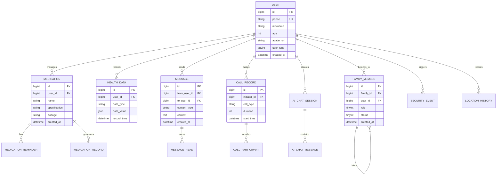
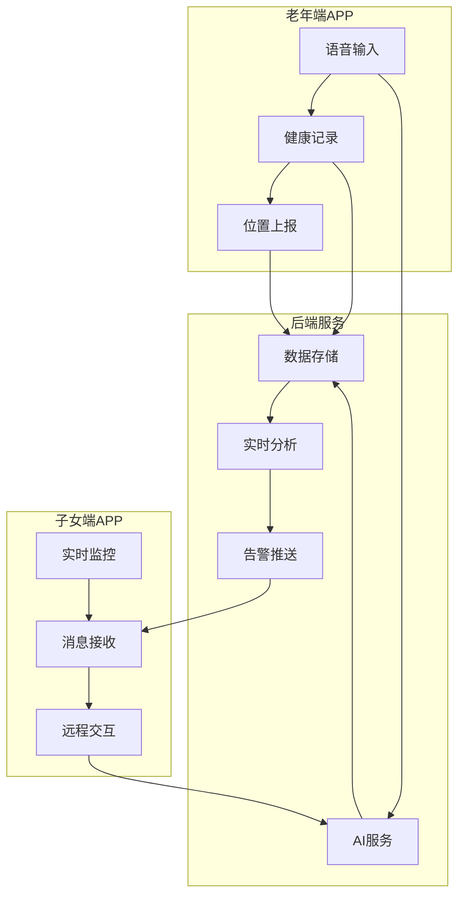

# 银龄守候·双模交互版 - 数据库设计文档

> 文档版本：v1.0  
> 更新日期：2025年12月21日  
> 文档状态：待完善

---

## 目录

- [1. 数据库概述](#1-数据库概述)
- [2. ER图设计](#2-er图设计)
- [3. 用户相关表](#3-用户相关表)
- [4. 健康管理表](#4-健康管理表)
- [5. 消息通讯表](#5-消息通讯表)
- [6. 安全防护表](#6-安全防护表)
- [7. 索引设计](#7-索引设计)

---

## 1. 数据库概述

### 1.1 基础信息

**数据库类型**：MySQL 8.0+

**字符集**：utf8mb4

**排序规则**：utf8mb4_unicode_ci

**时区设置**：Asia/Shanghai

**存储引擎**：InnoDB

### 1.2 命名规范

#### 表命名规范
- 表名使用小写字母，单词间用下划线分隔
- 表名前缀按模块划分：
  - `user_*`：用户相关表
  - `health_*`：健康管理相关表
  - `msg_*`：消息通讯相关表
  - `security_*`：安全防护相关表
  - `ai_*`：AI服务相关表
  - `sys_*`：系统配置相关表

#### 字段命名规范
- 字段名使用小写字母，单词间用下划线分隔
- 主键统一命名为 `id`
- 创建时间统一命名为 `created_at`
- 更新时间统一命名为 `updated_at`
- 软删除标识统一命名为 `deleted_at`
- 布尔类型字段以 `is_` 开头
- 状态字段以 `status` 结尾

#### 索引命名规范
- 主键索引：`pk_表名`
- 唯一索引：`uk_表名_字段名`
- 普通索引：`idx_表名_字段名`
- 联合索引：`idx_表名_字段1_字段2`

### 1.3 数据类型使用规范

| 数据类型 | 使用场景 | 示例 |
|:---------|:---------|:-----|
| BIGINT UNSIGNED | 主键ID（雪花算法） | `id BIGINT UNSIGNED PRIMARY KEY` |
| INT UNSIGNED | 一般整数（年龄、数量等） | `age INT UNSIGNED` |
| TINYINT | 状态、标识（0-255） | `status TINYINT DEFAULT 1` |
| VARCHAR(n) | 可变长度字符串 | `name VARCHAR(50)` |
| TEXT | 长文本内容 | `content TEXT` |
| DECIMAL(m,n) | 精确小数（金额、测量值） | `price DECIMAL(10,2)` |
| DATETIME | 日期时间 | `created_at DATETIME` |
| JSON | JSON数据 | `metadata JSON` |

### 1.4 分库分表策略

#### 数据库划分

```
yinling_guardian_main（主库）
├── 用户模块表 (user_*)
├── 系统配置表 (sys_*)
└── 字典表 (dict_*)

yinling_guardian_health（健康数据库）
├── 健康数据表 (health_*)
└── 药品管理表 (medication_*)

yinling_guardian_message（消息数据库）
├── 消息记录表 (msg_*)
└── 通话记录表 (call_*)

yinling_guardian_security（安全数据库）
├── 安全事件表 (security_*)
└── 日志表 (log_*)

yinling_guardian_ai（AI数据库）
├── AI服务日志表 (ai_log_*)
└── 对话记录表 (chat_*)
```

#### 分表策略

**高频大表分表方案**：

| 表名 | 分表依据 | 分表数量 | 路由键 |
|:-----|:---------|:---------|:-------|
| msg_record_* | 按月分表 | 12张/年 | created_at |
| health_data_* | 按用户分表 | 16张 | user_id % 16 |
| ai_log_* | 按月分表 | 12张/年 | created_at |
| call_record_* | 按月分表 | 12张/年 | created_at |

### 1.5 数据保留策略

| 数据类型 | 保留期限 | 归档策略 |
|:---------|:---------|:---------|
| 消息记录 | 6个月 | 超过6个月的数据归档到OSS |
| 通话记录 | 12个月 | 超过12个月的数据归档到OSS |
| AI日志 | 3个月 | 超过3个月的数据删除 |
| 健康数据 | 永久保留 | 超过3年的数据迁移到冷存储 |
| 安全日志 | 12个月 | 超过12个月的数据归档到OSS |
| 用户数据 | 永久保留 | 注销后保留90天 |

### 1.6 备份策略

**全量备份**：
- 频率：每天凌晨2:00执行
- 保留：最近7天的全量备份

**增量备份**：
- 频率：每4小时执行一次
- 保留：最近48小时的增量备份

**binlog配置**：
- 格式：ROW
- 保留：7天
- 同步：主从实时同步

### 1.7 性能优化

#### 读写分离
- 主库：承担所有写操作
- 从库1：承担查询操作（业务查询）
- 从库2：承担报表查询（统计分析）

#### 连接池配置
```yaml
datasource:
  hikari:
    minimum-idle: 10
    maximum-pool-size: 50
    connection-timeout: 30000
    idle-timeout: 600000
    max-lifetime: 1800000
```

#### 缓存策略
- 用户信息：Redis缓存，过期时间30分钟
- 药品信息：Redis缓存，过期时间24小时
- 配置信息：Redis缓存，永不过期
- 热点数据：使用本地缓存（Caffeine）+ Redis二级缓存

## 2. ER图设计

### 2.1 核心实体关系图



### 2.2 模块关系说明

#### 用户家庭模块
```
用户表 (user)
    ↓ 1:N
家庭成员表 (family_member)
    ↓ 家庭关系
家庭关系网络
```

- 一个用户可以属于多个家庭
- 一个家庭包含多个成员
- 家庭成员有不同角色：长辈、子女、护工等

#### 健康管理模块
```
用户表 (user)
    ↓ 1:N
药品表 (medication)
    ↓ 1:N
用药提醒表 (medication_reminder)
    ↓ 1:N
用药记录表 (medication_record)

用户表 (user)
    ↓ 1:N
健康数据表 (health_data)
    ↓ 关联
健康报告表 (health_report)
```

#### 消息通讯模块
```
用户表 (user)
    ↓ 发送/接收
消息表 (message)
    ↓ 1:N
消息已读表 (message_read)

用户表 (user)
    ↓ 发起/接收
通话记录表 (call_record)
    ↓ 1:N
通话参与者表 (call_participant)
```

#### AI服务模块
```
用户表 (user)
    ↓ 1:N
AI对话会话表 (ai_chat_session)
    ↓ 1:N
AI对话消息表 (ai_chat_message)

用户表 (user)
    ↓ 1:N
AI服务日志表 (ai_log)
```

#### 安全防护模块
```
用户表 (user)
    ↓ 1:N
安全事件表 (security_event)
    ↓ 关联
位置历史表 (location_history)
    ↓ 关联
围栏设置表 (geofence)
```

### 2.3 数据流转图



### 2.4 核心表关系矩阵

| 表名 | user | family_member | medication | health_data | message | call_record | ai_chat_session |
|:-----|:----:|:-------------:|:----------:|:-----------:|:-------:|:-----------:|:---------------:|
| user | - | 1:N | 1:N | 1:N | 1:N | 1:N | 1:N |
| family_member | N:1 | - | - | - | - | - | - |
| medication | N:1 | - | - | - | - | - | - |
| health_data | N:1 | - | 关联 | - | - | - | - |
| message | N:1 | - | - | - | - | - | - |
| call_record | N:1 | - | - | - | - | - | - |
| ai_chat_session | N:1 | - | - | - | - | - | - |

**关系说明**：
- `1:N`：一对多关系
- `N:1`：多对一关系
- `关联`：业务关联关系
- `-`：无直接关系

## 3. 用户相关表

### 3.1 用户表 (user)

**表名**：`user`

**功能说明**：存储所有用户的基础信息

**表结构**：

```sql
CREATE TABLE `user` (
  `id` BIGINT UNSIGNED NOT NULL COMMENT '用户ID（雪花算法）',
  `phone` VARCHAR(20) NOT NULL COMMENT '手机号',
  `password` VARCHAR(255) NOT NULL COMMENT '密码（BCrypt加密）',
  `nickname` VARCHAR(50) NOT NULL COMMENT '昵称',
  `real_name` VARCHAR(50) DEFAULT NULL COMMENT '真实姓名',
  `avatar_url` VARCHAR(255) DEFAULT NULL COMMENT '头像URL',
  `gender` TINYINT DEFAULT 0 COMMENT '性别：0-未知 1-男 2-女',
  `birthday` DATE DEFAULT NULL COMMENT '生日',
  `age` INT UNSIGNED DEFAULT NULL COMMENT '年龄',
  `id_card` VARCHAR(18) DEFAULT NULL COMMENT '身份证号（加密存储）',
  `user_type` TINYINT NOT NULL DEFAULT 1 COMMENT '用户类型：1-老年人 2-子女 3-护工',
  `status` TINYINT NOT NULL DEFAULT 1 COMMENT '账号状态：1-正常 2-冻结 3-注销',
  `last_login_time` DATETIME DEFAULT NULL COMMENT '最后登录时间',
  `last_login_ip` VARCHAR(50) DEFAULT NULL COMMENT '最后登录IP',
  `created_at` DATETIME NOT NULL DEFAULT CURRENT_TIMESTAMP COMMENT '创建时间',
  `updated_at` DATETIME NOT NULL DEFAULT CURRENT_TIMESTAMP ON UPDATE CURRENT_TIMESTAMP COMMENT '更新时间',
  `deleted_at` DATETIME DEFAULT NULL COMMENT '删除时间（软删除）',
  PRIMARY KEY (`id`),
  UNIQUE KEY `uk_phone` (`phone`),
  KEY `idx_user_type` (`user_type`),
  KEY `idx_status` (`status`),
  KEY `idx_created_at` (`created_at`)
) ENGINE=InnoDB DEFAULT CHARSET=utf8mb4 COLLATE=utf8mb4_unicode_ci COMMENT='用户表';
```

**字段说明**：

| 字段 | 类型 | 说明 | 备注 |
|:----|:-----|:-----|:-----|
| id | BIGINT UNSIGNED | 主键 | 使用雪花算法生成 |
| phone | VARCHAR(20) | 手机号 | 唯一，用于登录 |
| password | VARCHAR(255) | 密码 | BCrypt加密，不可逆 |
| nickname | VARCHAR(50) | 昵称 | 显示名称 |
| user_type | TINYINT | 用户类型 | 1-老年人 2-子女 3-护工 |
| status | TINYINT | 账号状态 | 1-正常 2-冻结 3-注销 |

### 3.2 家庭成员表 (family_member)

**表名**：`family_member`

**功能说明**：记录家庭成员关系

**表结构**：

```sql
CREATE TABLE `family_member` (
  `id` BIGINT UNSIGNED NOT NULL COMMENT '记录ID',
  `family_id` BIGINT UNSIGNED NOT NULL COMMENT '家庭ID',
  `user_id` BIGINT UNSIGNED NOT NULL COMMENT '用户ID',
  `role` TINYINT NOT NULL COMMENT '角色：1-长辈 2-子女 3-配偶 4-护工',
  `nickname` VARCHAR(50) DEFAULT NULL COMMENT '家庭内昵称',
  `relation` VARCHAR(20) DEFAULT NULL COMMENT '关系称呼（爷爷、奶奶、儿子、女儿等）',
  `is_primary` TINYINT NOT NULL DEFAULT 0 COMMENT '是否主要联系人：0-否 1-是',
  `status` TINYINT NOT NULL DEFAULT 1 COMMENT '状态：1-正常 2-已解绑',
  `bound_at` DATETIME NOT NULL COMMENT '绑定时间',
  `bound_by` BIGINT UNSIGNED DEFAULT NULL COMMENT '绑定操作人ID',
  `created_at` DATETIME NOT NULL DEFAULT CURRENT_TIMESTAMP COMMENT '创建时间',
  `updated_at` DATETIME NOT NULL DEFAULT CURRENT_TIMESTAMP ON UPDATE CURRENT_TIMESTAMP COMMENT '更新时间',
  PRIMARY KEY (`id`),
  UNIQUE KEY `uk_family_user` (`family_id`, `user_id`),
  KEY `idx_family_id` (`family_id`),
  KEY `idx_user_id` (`user_id`),
  KEY `idx_role` (`role`)
) ENGINE=InnoDB DEFAULT CHARSET=utf8mb4 COLLATE=utf8mb4_unicode_ci COMMENT='家庭成员表';
```

**关系说明**：
- 一个家庭可以有多个成员
- 一个用户可以属于多个家庭（例如：既是父母家庭的子女，又是自己家庭的家长）
- 通过 `family_id` 将同一家庭的成员关联在一起

### 3.3 用户设置表 (user_setting)

**表名**：`user_setting`

**功能说明**：存储用户的个性化设置

**表结构**：

```sql
CREATE TABLE `user_setting` (
  `id` BIGINT UNSIGNED NOT NULL COMMENT '设置ID',
  `user_id` BIGINT UNSIGNED NOT NULL COMMENT '用户ID',
  `voice_speed` DECIMAL(3,1) NOT NULL DEFAULT 1.0 COMMENT '语音播报速度：0.5-2.0',
  `voice_volume` INT UNSIGNED NOT NULL DEFAULT 80 COMMENT '语音音量：0-100',
  `voice_person` VARCHAR(20) NOT NULL DEFAULT 'xiaoyan' COMMENT '发音人：xiaoyan/xiaoyu等',
  `font_size` VARCHAR(20) NOT NULL DEFAULT 'EXTRA_LARGE' COMMENT '字体大小',
  `theme_mode` VARCHAR(20) NOT NULL DEFAULT 'LIGHT' COMMENT '主题模式：LIGHT/DARK',
  `notification_enabled` TINYINT NOT NULL DEFAULT 1 COMMENT '是否开启通知：0-否 1-是',
  `vibrate_enabled` TINYINT NOT NULL DEFAULT 1 COMMENT '是否开启震动：0-否 1-是',
  `location_share_enabled` TINYINT NOT NULL DEFAULT 1 COMMENT '是否开启位置共享：0-否 1-是',
  `privacy_settings` JSON DEFAULT NULL COMMENT '隐私设置（JSON）',
  `created_at` DATETIME NOT NULL DEFAULT CURRENT_TIMESTAMP COMMENT '创建时间',
  `updated_at` DATETIME NOT NULL DEFAULT CURRENT_TIMESTAMP ON UPDATE CURRENT_TIMESTAMP COMMENT '更新时间',
  PRIMARY KEY (`id`),
  UNIQUE KEY `uk_user_id` (`user_id`)
) ENGINE=InnoDB DEFAULT CHARSET=utf8mb4 COLLATE=utf8mb4_unicode_ci COMMENT='用户设置表';
```

### 3.4 联系人表 (contact)

**表名**：`contact`

**功能说明**：存储用户的联系人信息

**表结构**：

```sql
CREATE TABLE `contact` (
  `id` BIGINT UNSIGNED NOT NULL COMMENT '联系人ID',
  `user_id` BIGINT UNSIGNED NOT NULL COMMENT '用户ID',
  `contact_user_id` BIGINT UNSIGNED DEFAULT NULL COMMENT '关联的用户ID（如果是注册用户）',
  `name` VARCHAR(50) NOT NULL COMMENT '联系人姓名',
  `phone` VARCHAR(20) NOT NULL COMMENT '联系人电话',
  `avatar_url` VARCHAR(255) DEFAULT NULL COMMENT '头像URL',
  `relation` VARCHAR(20) DEFAULT NULL COMMENT '关系（儿子、女儿、医生等）',
  `is_emergency` TINYINT NOT NULL DEFAULT 0 COMMENT '是否紧急联系人：0-否 1-是',
  `sort_order` INT UNSIGNED NOT NULL DEFAULT 0 COMMENT '排序顺序',
  `remark` VARCHAR(200) DEFAULT NULL COMMENT '备注',
  `created_at` DATETIME NOT NULL DEFAULT CURRENT_TIMESTAMP COMMENT '创建时间',
  `updated_at` DATETIME NOT NULL DEFAULT CURRENT_TIMESTAMP ON UPDATE CURRENT_TIMESTAMP COMMENT '更新时间',
  PRIMARY KEY (`id`),
  KEY `idx_user_id` (`user_id`),
  KEY `idx_contact_user_id` (`contact_user_id`),
  KEY `idx_is_emergency` (`is_emergency`)
) ENGINE=InnoDB DEFAULT CHARSET=utf8mb4 COLLATE=utf8mb4_unicode_ci COMMENT='联系人表';
```

### 3.5 用户Token表 (user_token)

**表名**：`user_token`

**功能说明**：存储用户的登录Token信息

**表结构**：

```sql
CREATE TABLE `user_token` (
  `id` BIGINT UNSIGNED NOT NULL COMMENT 'Token ID',
  `user_id` BIGINT UNSIGNED NOT NULL COMMENT '用户ID',
  `access_token` VARCHAR(500) NOT NULL COMMENT '访问Token',
  `refresh_token` VARCHAR(500) NOT NULL COMMENT '刷新Token',
  `device_id` VARCHAR(100) DEFAULT NULL COMMENT '设备ID',
  `device_type` VARCHAR(20) DEFAULT NULL COMMENT '设备类型：ANDROID/IOS/WEB',
  `device_name` VARCHAR(100) DEFAULT NULL COMMENT '设备名称',
  `ip_address` VARCHAR(50) DEFAULT NULL COMMENT '登录IP',
  `user_agent` VARCHAR(500) DEFAULT NULL COMMENT '用户代理',
  `expires_at` DATETIME NOT NULL COMMENT 'Token过期时间',
  `refresh_expires_at` DATETIME NOT NULL COMMENT '刷新Token过期时间',
  `status` TINYINT NOT NULL DEFAULT 1 COMMENT '状态：1-有效 2-已失效 3-已撤销',
  `created_at` DATETIME NOT NULL DEFAULT CURRENT_TIMESTAMP COMMENT '创建时间',
  `updated_at` DATETIME NOT NULL DEFAULT CURRENT_TIMESTAMP ON UPDATE CURRENT_TIMESTAMP COMMENT '更新时间',
  PRIMARY KEY (`id`),
  UNIQUE KEY `uk_access_token` (`access_token`(255)),
  UNIQUE KEY `uk_refresh_token` (`refresh_token`(255)),
  KEY `idx_user_id` (`user_id`),
  KEY `idx_device_id` (`device_id`),
  KEY `idx_expires_at` (`expires_at`)
) ENGINE=InnoDB DEFAULT CHARSET=utf8mb4 COLLATE=utf8mb4_unicode_ci COMMENT='用户Token表';
```

### 3.6 用户登录日志表 (user_login_log)

**表名**：`user_login_log`

**功能说明**：记录用户登录历史

**表结构**：

```sql
CREATE TABLE `user_login_log` (
  `id` BIGINT UNSIGNED NOT NULL COMMENT '日志ID',
  `user_id` BIGINT UNSIGNED NOT NULL COMMENT '用户ID',
  `login_type` TINYINT NOT NULL COMMENT '登录方式：1-密码 2-验证码 3-生物识别',
  `device_type` VARCHAR(20) NOT NULL COMMENT '设备类型',
  `device_id` VARCHAR(100) DEFAULT NULL COMMENT '设备ID',
  `ip_address` VARCHAR(50) NOT NULL COMMENT '登录IP',
  `location` VARCHAR(100) DEFAULT NULL COMMENT '登录地点',
  `user_agent` VARCHAR(500) DEFAULT NULL COMMENT '用户代理',
  `login_status` TINYINT NOT NULL COMMENT '登录状态：1-成功 2-失败',
  `fail_reason` VARCHAR(100) DEFAULT NULL COMMENT '失败原因',
  `login_time` DATETIME NOT NULL COMMENT '登录时间',
  `created_at` DATETIME NOT NULL DEFAULT CURRENT_TIMESTAMP COMMENT '创建时间',
  PRIMARY KEY (`id`),
  KEY `idx_user_id` (`user_id`),
  KEY `idx_login_time` (`login_time`),
  KEY `idx_login_status` (`login_status`)
) ENGINE=InnoDB DEFAULT CHARSET=utf8mb4 COLLATE=utf8mb4_unicode_ci COMMENT='用户登录日志表';
```

## 4. 健康管理表

### 4.1 药品信息表 (medication)

**表名**：`medication`

**功能说明**：存储用户的药品信息

**表结构**：

```sql
CREATE TABLE `medication` (
  `id` BIGINT UNSIGNED NOT NULL COMMENT '药品ID',
  `user_id` BIGINT UNSIGNED NOT NULL COMMENT '用户ID',
  `name` VARCHAR(100) NOT NULL COMMENT '药品名称',
  `generic_name` VARCHAR(100) DEFAULT NULL COMMENT '通用名',
  `manufacturer` VARCHAR(200) DEFAULT NULL COMMENT '生产厂家',
  `specification` VARCHAR(100) DEFAULT NULL COMMENT '规格（如：100mg×30片）',
  `approval_number` VARCHAR(50) DEFAULT NULL COMMENT '批准文号',
  `dosage_form` VARCHAR(50) DEFAULT NULL COMMENT '剂型（片剂、胶囊等）',
  `usage` TEXT DEFAULT NULL COMMENT '用法用量',
  `indications` TEXT DEFAULT NULL COMMENT '适应症',
  `contraindications` TEXT DEFAULT NULL COMMENT '禁忌症',
  `side_effects` TEXT DEFAULT NULL COMMENT '副作用',
  `precautions` TEXT DEFAULT NULL COMMENT '注意事项',
  `expiry_date` DATE DEFAULT NULL COMMENT '有效期',
  `batch_number` VARCHAR(50) DEFAULT NULL COMMENT '批号',
  `image_url` VARCHAR(255) DEFAULT NULL COMMENT '药品图片URL',
  `recognition_source` VARCHAR(20) DEFAULT NULL COMMENT '识别来源：MANUAL/OCR/SCAN',
  `stock_quantity` INT UNSIGNED DEFAULT 0 COMMENT '库存数量',
  `stock_unit` VARCHAR(20) DEFAULT NULL COMMENT '库存单位（片、盒等）',
  `status` TINYINT NOT NULL DEFAULT 1 COMMENT '状态：1-使用中 2-已停用 3-已过期',
  `remark` VARCHAR(500) DEFAULT NULL COMMENT '备注',
  `created_at` DATETIME NOT NULL DEFAULT CURRENT_TIMESTAMP COMMENT '创建时间',
  `updated_at` DATETIME NOT NULL DEFAULT CURRENT_TIMESTAMP ON UPDATE CURRENT_TIMESTAMP COMMENT '更新时间',
  PRIMARY KEY (`id`),
  KEY `idx_user_id` (`user_id`),
  KEY `idx_name` (`name`),
  KEY `idx_status` (`status`),
  KEY `idx_expiry_date` (`expiry_date`)
) ENGINE=InnoDB DEFAULT CHARSET=utf8mb4 COLLATE=utf8mb4_unicode_ci COMMENT='药品信息表';
```

### 4.2 用药提醒表 (medication_reminder)

**表名**：`medication_reminder`

**功能说明**：存储用药提醒设置

**表结构**：

```sql
CREATE TABLE `medication_reminder` (
  `id` BIGINT UNSIGNED NOT NULL COMMENT '提醒ID',
  `user_id` BIGINT UNSIGNED NOT NULL COMMENT '用户ID',
  `medication_id` BIGINT UNSIGNED NOT NULL COMMENT '药品ID',
  `reminder_name` VARCHAR(100) NOT NULL COMMENT '提醒名称',
  `dosage` VARCHAR(50) NOT NULL COMMENT '剂量（如：2片、1粒）',
  `frequency_type` TINYINT NOT NULL COMMENT '频率类型：1-每天 2-按周 3-间隔天数 4-按需',
  `frequency_value` VARCHAR(100) NOT NULL COMMENT '频率值（JSON格式）',
  `reminder_times` JSON NOT NULL COMMENT '提醒时间列表（JSON数组）',
  `start_date` DATE NOT NULL COMMENT '开始日期',
  `end_date` DATE DEFAULT NULL COMMENT '结束日期（为空表示长期）',
  `before_meal` TINYINT DEFAULT NULL COMMENT '餐前餐后：1-餐前 2-餐后 3-随餐',
  `special_instructions` VARCHAR(500) DEFAULT NULL COMMENT '特殊说明',
  `notification_enabled` TINYINT NOT NULL DEFAULT 1 COMMENT '是否推送通知：0-否 1-是',
  `voice_enabled` TINYINT NOT NULL DEFAULT 1 COMMENT '是否语音提醒：0-否 1-是',
  `family_notify_enabled` TINYINT NOT NULL DEFAULT 0 COMMENT '是否通知家人：0-否 1-是',
  `status` TINYINT NOT NULL DEFAULT 1 COMMENT '状态：1-启用 2-暂停 3-已完成',
  `created_at` DATETIME NOT NULL DEFAULT CURRENT_TIMESTAMP COMMENT '创建时间',
  `updated_at` DATETIME NOT NULL DEFAULT CURRENT_TIMESTAMP ON UPDATE CURRENT_TIMESTAMP COMMENT '更新时间',
  PRIMARY KEY (`id`),
  KEY `idx_user_id` (`user_id`),
  KEY `idx_medication_id` (`medication_id`),
  KEY `idx_status` (`status`),
  KEY `idx_start_date` (`start_date`)
) ENGINE=InnoDB DEFAULT CHARSET=utf8mb4 COLLATE=utf8mb4_unicode_ci COMMENT='用药提醒表';
```

**frequency_value 示例**：
```json
// 每天
{"type": "DAILY"}

// 按周（周一、周三、周五）
{"type": "WEEKLY", "days": [1, 3, 5]}

// 间隔天数（每隔2天）
{"type": "INTERVAL", "days": 2}
```

**reminder_times 示例**：
```json
["08:00", "12:00", "18:00"]
```

### 4.3 用药记录表 (medication_record)

**表名**：`medication_record`

**功能说明**：记录实际用药情况

**表结构**：

```sql
CREATE TABLE `medication_record` (
  `id` BIGINT UNSIGNED NOT NULL COMMENT '记录ID',
  `user_id` BIGINT UNSIGNED NOT NULL COMMENT '用户ID',
  `medication_id` BIGINT UNSIGNED NOT NULL COMMENT '药品ID',
  `reminder_id` BIGINT UNSIGNED DEFAULT NULL COMMENT '提醒ID',
  `planned_time` DATETIME NOT NULL COMMENT '计划服药时间',
  `actual_time` DATETIME DEFAULT NULL COMMENT '实际服药时间',
  `dosage` VARCHAR(50) NOT NULL COMMENT '剂量',
  `status` TINYINT NOT NULL COMMENT '状态：1-已服用 2-已跳过 3-延迟服用 4-未服用',
  `skip_reason` VARCHAR(200) DEFAULT NULL COMMENT '跳过原因',
  `side_effect` VARCHAR(500) DEFAULT NULL COMMENT '不良反应',
  `remark` VARCHAR(500) DEFAULT NULL COMMENT '备注',
  `recorded_by` VARCHAR(20) NOT NULL COMMENT '记录方式：USER/FAMILY/AUTO',
  `created_at` DATETIME NOT NULL DEFAULT CURRENT_TIMESTAMP COMMENT '创建时间',
  `updated_at` DATETIME NOT NULL DEFAULT CURRENT_TIMESTAMP ON UPDATE CURRENT_TIMESTAMP COMMENT '更新时间',
  PRIMARY KEY (`id`),
  KEY `idx_user_id` (`user_id`),
  KEY `idx_medication_id` (`medication_id`),
  KEY `idx_reminder_id` (`reminder_id`),
  KEY `idx_planned_time` (`planned_time`),
  KEY `idx_status` (`status`)
) ENGINE=InnoDB DEFAULT CHARSET=utf8mb4 COLLATE=utf8mb4_unicode_ci COMMENT='用药记录表';
```

### 4.4 健康数据表 (health_data)

**表名**：`health_data` (按用户分表：health_data_0 ~ health_data_15)

**功能说明**：存储用户的各类健康数据

**表结构**：

```sql
CREATE TABLE `health_data_0` (
  `id` BIGINT UNSIGNED NOT NULL COMMENT '数据ID',
  `user_id` BIGINT UNSIGNED NOT NULL COMMENT '用户ID',
  `data_type` VARCHAR(50) NOT NULL COMMENT '数据类型：BLOOD_PRESSURE/BLOOD_SUGAR/HEART_RATE等',
  `data_value` JSON NOT NULL COMMENT '数据值（JSON格式）',
  `unit` VARCHAR(20) DEFAULT NULL COMMENT '单位',
  `record_time` DATETIME NOT NULL COMMENT '记录时间',
  `record_source` VARCHAR(20) NOT NULL COMMENT '记录来源：MANUAL/DEVICE/IMPORT',
  `device_id` VARCHAR(100) DEFAULT NULL COMMENT '设备ID',
  `location` VARCHAR(200) DEFAULT NULL COMMENT '记录地点',
  `remark` VARCHAR(500) DEFAULT NULL COMMENT '备注',
  `is_abnormal` TINYINT NOT NULL DEFAULT 0 COMMENT '是否异常：0-正常 1-异常',
  `abnormal_level` TINYINT DEFAULT NULL COMMENT '异常级别：1-轻微 2-中度 3-严重',
  `created_at` DATETIME NOT NULL DEFAULT CURRENT_TIMESTAMP COMMENT '创建时间',
  `updated_at` DATETIME NOT NULL DEFAULT CURRENT_TIMESTAMP ON UPDATE CURRENT_TIMESTAMP COMMENT '更新时间',
  PRIMARY KEY (`id`),
  KEY `idx_user_id` (`user_id`),
  KEY `idx_data_type` (`data_type`),
  KEY `idx_record_time` (`record_time`),
  KEY `idx_is_abnormal` (`is_abnormal`)
) ENGINE=InnoDB DEFAULT CHARSET=utf8mb4 COLLATE=utf8mb4_unicode_ci COMMENT='健康数据表';
```

**data_value 示例**：
```json
// 血压
{
  "systolic": 135,
  "diastolic": 85,
  "pulse": 75
}

// 血糖
{
  "value": 6.5,
  "measureType": "FASTING"
}

// 体重
{
  "weight": 70.5,
  "bmi": 23.8
}
```

**数据类型枚举**：
- `BLOOD_PRESSURE`：血压
- `BLOOD_SUGAR`：血糖
- `HEART_RATE`：心率
- `WEIGHT`：体重
- `TEMPERATURE`：体温
- `OXYGEN_SATURATION`：血氧饱和度
- `SLEEP`：睡眠数据
- `STEPS`：步数

### 4.5 健康报告表 (health_report)

**表名**：`health_report`

**功能说明**：存储健康报告信息

**表结构**：

```sql
CREATE TABLE `health_report` (
  `id` BIGINT UNSIGNED NOT NULL COMMENT '报告ID',
  `user_id` BIGINT UNSIGNED NOT NULL COMMENT '用户ID',
  `report_type` VARCHAR(50) NOT NULL COMMENT '报告类型：WEEKLY/MONTHLY/CUSTOM',
  `report_title` VARCHAR(200) NOT NULL COMMENT '报告标题',
  `start_date` DATE NOT NULL COMMENT '统计开始日期',
  `end_date` DATE NOT NULL COMMENT '统计结束日期',
  `summary` JSON NOT NULL COMMENT '报告摘要（JSON）',
  `blood_pressure_analysis` JSON DEFAULT NULL COMMENT '血压分析',
  `blood_sugar_analysis` JSON DEFAULT NULL COMMENT '血糖分析',
  `medication_compliance` JSON DEFAULT NULL COMMENT '用药依从性',
  `health_score` INT UNSIGNED DEFAULT NULL COMMENT '健康评分（0-100）',
  `risk_assessment` JSON DEFAULT NULL COMMENT '风险评估',
  `suggestions` TEXT DEFAULT NULL COMMENT '健康建议',
  `report_file_url` VARCHAR(255) DEFAULT NULL COMMENT '报告文件URL（PDF）',
  `generated_at` DATETIME NOT NULL COMMENT '生成时间',
  `status` TINYINT NOT NULL DEFAULT 1 COMMENT '状态：1-已生成 2-已读 3-已分享',
  `shared_to` JSON DEFAULT NULL COMMENT '分享给谁（用户ID数组）',
  `created_at` DATETIME NOT NULL DEFAULT CURRENT_TIMESTAMP COMMENT '创建时间',
  `updated_at` DATETIME NOT NULL DEFAULT CURRENT_TIMESTAMP ON UPDATE CURRENT_TIMESTAMP COMMENT '更新时间',
  PRIMARY KEY (`id`),
  KEY `idx_user_id` (`user_id`),
  KEY `idx_report_type` (`report_type`),
  KEY `idx_generated_at` (`generated_at`)
) ENGINE=InnoDB DEFAULT CHARSET=utf8mb4 COLLATE=utf8mb4_unicode_ci COMMENT='健康报告表';
```

### 4.6 体检记录表 (medical_examination)

**表名**：`medical_examination`

**功能说明**：存储体检记录

**表结构**：

```sql
CREATE TABLE `medical_examination` (
  `id` BIGINT UNSIGNED NOT NULL COMMENT '体检ID',
  `user_id` BIGINT UNSIGNED NOT NULL COMMENT '用户ID',
  `exam_date` DATE NOT NULL COMMENT '体检日期',
  `hospital` VARCHAR(200) DEFAULT NULL COMMENT '体检医院',
  `exam_type` VARCHAR(100) DEFAULT NULL COMMENT '体检类型（常规体检、专项检查等）',
  `height` DECIMAL(5,2) DEFAULT NULL COMMENT '身高（cm）',
  `weight` DECIMAL(5,2) DEFAULT NULL COMMENT '体重（kg）',
  `bmi` DECIMAL(5,2) DEFAULT NULL COMMENT 'BMI指数',
  `blood_pressure` VARCHAR(20) DEFAULT NULL COMMENT '血压',
  `blood_sugar` DECIMAL(5,2) DEFAULT NULL COMMENT '血糖',
  `exam_results` JSON DEFAULT NULL COMMENT '体检结果（JSON）',
  `abnormal_items` JSON DEFAULT NULL COMMENT '异常项目',
  `doctor_advice` TEXT DEFAULT NULL COMMENT '医生建议',
  `report_images` JSON DEFAULT NULL COMMENT '报告图片（URL数组）',
  `next_exam_date` DATE DEFAULT NULL COMMENT '下次体检日期',
  `remark` VARCHAR(500) DEFAULT NULL COMMENT '备注',
  `created_at` DATETIME NOT NULL DEFAULT CURRENT_TIMESTAMP COMMENT '创建时间',
  `updated_at` DATETIME NOT NULL DEFAULT CURRENT_TIMESTAMP ON UPDATE CURRENT_TIMESTAMP COMMENT '更新时间',
  PRIMARY KEY (`id`),
  KEY `idx_user_id` (`user_id`),
  KEY `idx_exam_date` (`exam_date`)
) ENGINE=InnoDB DEFAULT CHARSET=utf8mb4 COLLATE=utf8mb4_unicode_ci COMMENT='体检记录表';
```

## 5. 消息通讯表

### 5.1 消息记录表 (msg_record)

**表名**：`msg_record` (按月分表：msg_record_202501 ~ msg_record_202512)

**功能说明**：存储用户间的消息记录

**表结构**：

```sql
CREATE TABLE `msg_record_202501` (
  `id` BIGINT UNSIGNED NOT NULL COMMENT '消息ID',
  `from_user_id` BIGINT UNSIGNED NOT NULL COMMENT '发送者ID',
  `to_user_id` BIGINT UNSIGNED NOT NULL COMMENT '接收者ID',
  `session_id` VARCHAR(100) NOT NULL COMMENT '会话ID',
  `content_type` VARCHAR(20) NOT NULL COMMENT '消息类型：TEXT/VOICE/IMAGE/VIDEO',
  `content` TEXT NOT NULL COMMENT '消息内容',
  `content_url` VARCHAR(255) DEFAULT NULL COMMENT '媒体文件URL',
  `duration` INT UNSIGNED DEFAULT NULL COMMENT '时长（秒，音视频消息）',
  `file_size` BIGINT UNSIGNED DEFAULT NULL COMMENT '文件大小（字节）',
  `thumbnail_url` VARCHAR(255) DEFAULT NULL COMMENT '缩略图URL',
  `is_read` TINYINT NOT NULL DEFAULT 0 COMMENT '是否已读：0-未读 1-已读',
  `read_at` DATETIME DEFAULT NULL COMMENT '阅读时间',
  `is_recalled` TINYINT NOT NULL DEFAULT 0 COMMENT '是否撤回：0-否 1-是',
  `recalled_at` DATETIME DEFAULT NULL COMMENT '撤回时间',
  `reply_to_msg_id` BIGINT UNSIGNED DEFAULT NULL COMMENT '回复的消息ID',
  `extra_data` JSON DEFAULT NULL COMMENT '扩展数据',
  `send_status` TINYINT NOT NULL DEFAULT 1 COMMENT '发送状态：1-发送中 2-已发送 3-发送失败',
  `created_at` DATETIME NOT NULL DEFAULT CURRENT_TIMESTAMP COMMENT '创建时间',
  `updated_at` DATETIME NOT NULL DEFAULT CURRENT_TIMESTAMP ON UPDATE CURRENT_TIMESTAMP COMMENT '更新时间',
  PRIMARY KEY (`id`),
  KEY `idx_from_user` (`from_user_id`),
  KEY `idx_to_user` (`to_user_id`),
  KEY `idx_session_id` (`session_id`),
  KEY `idx_is_read` (`is_read`),
  KEY `idx_created_at` (`created_at`)
) ENGINE=InnoDB DEFAULT CHARSET=utf8mb4 COLLATE=utf8mb4_unicode_ci COMMENT='消息记录表';
```

**内容类型说明**：
- `TEXT`：文本消息
- `VOICE`：语音消息
- `IMAGE`：图片消息
- `VIDEO`：视频消息
- `LOCATION`：位置消息
- `HEALTH_DATA`：健康数据分享
- `MEDICATION`：用药提醒分享

### 5.2 会话列表表 (msg_session)

**表名**：`msg_session`

**功能说明**：存储用户的会话列表

**表结构**：

```sql
CREATE TABLE `msg_session` (
  `id` BIGINT UNSIGNED NOT NULL COMMENT '会话ID',
  `session_id` VARCHAR(100) NOT NULL COMMENT '会话唯一标识',
  `user_id` BIGINT UNSIGNED NOT NULL COMMENT '用户ID',
  `peer_user_id` BIGINT UNSIGNED NOT NULL COMMENT '对方用户ID',
  `session_type` TINYINT NOT NULL DEFAULT 1 COMMENT '会话类型：1-单聊 2-群聊',
  `last_message` TEXT DEFAULT NULL COMMENT '最后一条消息内容',
  `last_message_time` DATETIME DEFAULT NULL COMMENT '最后消息时间',
  `unread_count` INT UNSIGNED NOT NULL DEFAULT 0 COMMENT '未读消息数',
  `is_top` TINYINT NOT NULL DEFAULT 0 COMMENT '是否置顶：0-否 1-是',
  `is_muted` TINYINT NOT NULL DEFAULT 0 COMMENT '是否免打扰：0-否 1-是',
  `is_deleted` TINYINT NOT NULL DEFAULT 0 COMMENT '是否删除：0-否 1-是',
  `created_at` DATETIME NOT NULL DEFAULT CURRENT_TIMESTAMP COMMENT '创建时间',
  `updated_at` DATETIME NOT NULL DEFAULT CURRENT_TIMESTAMP ON UPDATE CURRENT_TIMESTAMP COMMENT '更新时间',
  PRIMARY KEY (`id`),
  UNIQUE KEY `uk_user_session` (`user_id`, `session_id`),
  KEY `idx_user_id` (`user_id`),
  KEY `idx_last_message_time` (`last_message_time`)
) ENGINE=InnoDB DEFAULT CHARSET=utf8mb4 COLLATE=utf8mb4_unicode_ci COMMENT='会话列表表';
```

### 5.3 通话记录表 (call_record)

**表名**：`call_record` (按月分表：call_record_202501 ~ call_record_202512)

**功能说明**：存储语音/视频通话记录

**表结构**：

```sql
CREATE TABLE `call_record_202501` (
  `id` BIGINT UNSIGNED NOT NULL COMMENT '通话ID',
  `call_id` VARCHAR(100) NOT NULL COMMENT '通话唯一标识',
  `initiator_id` BIGINT UNSIGNED NOT NULL COMMENT '发起者ID',
  `receiver_id` BIGINT UNSIGNED NOT NULL COMMENT '接收者ID',
  `call_type` TINYINT NOT NULL COMMENT '通话类型：1-语音通话 2-视频通话',
  `call_status` TINYINT NOT NULL COMMENT '通话状态：1-已接通 2-未接通 3-已拒绝 4-已取消 5-超时',
  `start_time` DATETIME NOT NULL COMMENT '开始时间',
  `answer_time` DATETIME DEFAULT NULL COMMENT '接听时间',
  `end_time` DATETIME DEFAULT NULL COMMENT '结束时间',
  `duration` INT UNSIGNED DEFAULT 0 COMMENT '通话时长（秒）',
  `network_quality` JSON DEFAULT NULL COMMENT '网络质量（JSON）',
  `is_emergency` TINYINT NOT NULL DEFAULT 0 COMMENT '是否紧急通话：0-否 1-是',
  `end_reason` VARCHAR(50) DEFAULT NULL COMMENT '结束原因：HANGUP/TIMEOUT/NETWORK_ERROR等',
  `recording_url` VARCHAR(255) DEFAULT NULL COMMENT '录音URL（如果开启录音）',
  `created_at` DATETIME NOT NULL DEFAULT CURRENT_TIMESTAMP COMMENT '创建时间',
  `updated_at` DATETIME NOT NULL DEFAULT CURRENT_TIMESTAMP ON UPDATE CURRENT_TIMESTAMP COMMENT '更新时间',
  PRIMARY KEY (`id`),
  UNIQUE KEY `uk_call_id` (`call_id`),
  KEY `idx_initiator_id` (`initiator_id`),
  KEY `idx_receiver_id` (`receiver_id`),
  KEY `idx_start_time` (`start_time`),
  KEY `idx_is_emergency` (`is_emergency`)
) ENGINE=InnoDB DEFAULT CHARSET=utf8mb4 COLLATE=utf8mb4_unicode_ci COMMENT='通话记录表';
```

### 5.4 通话参与者表 (call_participant)

**表名**：`call_participant`

**功能说明**：记录多人通话的参与者信息

**表结构**：

```sql
CREATE TABLE `call_participant` (
  `id` BIGINT UNSIGNED NOT NULL COMMENT '记录ID',
  `call_id` VARCHAR(100) NOT NULL COMMENT '通话ID',
  `user_id` BIGINT UNSIGNED NOT NULL COMMENT '用户ID',
  `role` TINYINT NOT NULL COMMENT '角色：1-发起者 2-接听者 3-旁听者',
  `join_time` DATETIME DEFAULT NULL COMMENT '加入时间',
  `leave_time` DATETIME DEFAULT NULL COMMENT '离开时间',
  `duration` INT UNSIGNED DEFAULT 0 COMMENT '通话时长（秒）',
  `status` TINYINT NOT NULL COMMENT '状态：1-已接听 2-未接听 3-已拒绝',
  `created_at` DATETIME NOT NULL DEFAULT CURRENT_TIMESTAMP COMMENT '创建时间',
  `updated_at` DATETIME NOT NULL DEFAULT CURRENT_TIMESTAMP ON UPDATE CURRENT_TIMESTAMP COMMENT '更新时间',
  PRIMARY KEY (`id`),
  KEY `idx_call_id` (`call_id`),
  KEY `idx_user_id` (`user_id`)
) ENGINE=InnoDB DEFAULT CHARSET=utf8mb4 COLLATE=utf8mb4_unicode_ci COMMENT='通话参与者表';
```

### 5.5 语音留言表 (voice_message)

**表名**：`voice_message`

**功能说明**：存储语音留言信息

**表结构**：

```sql
CREATE TABLE `voice_message` (
  `id` BIGINT UNSIGNED NOT NULL COMMENT '留言ID',
  `from_user_id` BIGINT UNSIGNED NOT NULL COMMENT '发送者ID',
  `to_user_id` BIGINT UNSIGNED NOT NULL COMMENT '接收者ID',
  `voice_url` VARCHAR(255) NOT NULL COMMENT '语音文件URL',
  `duration` INT UNSIGNED NOT NULL COMMENT '时长（秒）',
  `file_size` BIGINT UNSIGNED NOT NULL COMMENT '文件大小（字节）',
  `transcription` TEXT DEFAULT NULL COMMENT '语音转文字内容',
  `transcription_confidence` DECIMAL(5,4) DEFAULT NULL COMMENT '转写置信度',
  `is_played` TINYINT NOT NULL DEFAULT 0 COMMENT '是否已播放：0-否 1-是',
  `played_at` DATETIME DEFAULT NULL COMMENT '播放时间',
  `play_count` INT UNSIGNED NOT NULL DEFAULT 0 COMMENT '播放次数',
  `is_replied` TINYINT NOT NULL DEFAULT 0 COMMENT '是否已回复：0-否 1-是',
  `reply_voice_id` BIGINT UNSIGNED DEFAULT NULL COMMENT '回复的留言ID',
  `created_at` DATETIME NOT NULL DEFAULT CURRENT_TIMESTAMP COMMENT '创建时间',
  `updated_at` DATETIME NOT NULL DEFAULT CURRENT_TIMESTAMP ON UPDATE CURRENT_TIMESTAMP COMMENT '更新时间',
  PRIMARY KEY (`id`),
  KEY `idx_from_user` (`from_user_id`),
  KEY `idx_to_user` (`to_user_id`),
  KEY `idx_is_played` (`is_played`),
  KEY `idx_created_at` (`created_at`)
) ENGINE=InnoDB DEFAULT CHARSET=utf8mb4 COLLATE=utf8mb4_unicode_ci COMMENT='语音留言表';
```

### 5.6 推送消息表 (push_message)

**表名**：`push_message`

**功能说明**：存储推送消息记录

**表结构**：

```sql
CREATE TABLE `push_message` (
  `id` BIGINT UNSIGNED NOT NULL COMMENT '推送ID',
  `user_id` BIGINT UNSIGNED NOT NULL COMMENT '用户ID',
  `push_type` VARCHAR(50) NOT NULL COMMENT '推送类型：MEDICATION/HEALTH_ALERT/MESSAGE/CALL等',
  `title` VARCHAR(200) NOT NULL COMMENT '推送标题',
  `content` TEXT NOT NULL COMMENT '推送内容',
  `extra_data` JSON DEFAULT NULL COMMENT '扩展数据',
  `priority` TINYINT NOT NULL DEFAULT 2 COMMENT '优先级：1-低 2-中 3-高 4-紧急',
  `push_channel` VARCHAR(50) NOT NULL COMMENT '推送渠道：JPUSH/APNS/FCMJ',
  `push_status` TINYINT NOT NULL DEFAULT 1 COMMENT '推送状态：1-待推送 2-已推送 3-推送失败',
  `push_time` DATETIME DEFAULT NULL COMMENT '推送时间',
  `is_read` TINYINT NOT NULL DEFAULT 0 COMMENT '是否已读：0-否 1-是',
  `read_at` DATETIME DEFAULT NULL COMMENT '阅读时间',
  `is_clicked` TINYINT NOT NULL DEFAULT 0 COMMENT '是否点击：0-否 1-是',
  `clicked_at` DATETIME DEFAULT NULL COMMENT '点击时间',
  `created_at` DATETIME NOT NULL DEFAULT CURRENT_TIMESTAMP COMMENT '创建时间',
  `updated_at` DATETIME NOT NULL DEFAULT CURRENT_TIMESTAMP ON UPDATE CURRENT_TIMESTAMP COMMENT '更新时间',
  PRIMARY KEY (`id`),
  KEY `idx_user_id` (`user_id`),
  KEY `idx_push_type` (`push_type`),
  KEY `idx_push_status` (`push_status`),
  KEY `idx_created_at` (`created_at`)
) ENGINE=InnoDB DEFAULT CHARSET=utf8mb4 COLLATE=utf8mb4_unicode_ci COMMENT='推送消息表';
```

### 5.7 通知设置表 (notification_setting)

**表名**：`notification_setting`

**功能说明**：存储用户的通知偏好设置

**表结构**：

```sql
CREATE TABLE `notification_setting` (
  `id` BIGINT UNSIGNED NOT NULL COMMENT '设置ID',
  `user_id` BIGINT UNSIGNED NOT NULL COMMENT '用户ID',
  `medication_reminder` TINYINT NOT NULL DEFAULT 1 COMMENT '用药提醒：0-关闭 1-开启',
  `health_alert` TINYINT NOT NULL DEFAULT 1 COMMENT '健康预警：0-关闭 1-开启',
  `message_notification` TINYINT NOT NULL DEFAULT 1 COMMENT '消息通知：0-关闭 1-开启',
  `call_notification` TINYINT NOT NULL DEFAULT 1 COMMENT '来电通知：0-关闭 1-开启',
  `family_activity` TINYINT NOT NULL DEFAULT 1 COMMENT '家人动态：0-关闭 1-开启',
  `system_notification` TINYINT NOT NULL DEFAULT 1 COMMENT '系统通知：0-关闭 1-开启',
  `quiet_start_time` TIME DEFAULT NULL COMMENT '免打扰开始时间',
  `quiet_end_time` TIME DEFAULT NULL COMMENT '免打扰结束时间',
  `sound_enabled` TINYINT NOT NULL DEFAULT 1 COMMENT '是否开启提示音：0-否 1-是',
  `vibrate_enabled` TINYINT NOT NULL DEFAULT 1 COMMENT '是否开启震动：0-否 1-是',
  `created_at` DATETIME NOT NULL DEFAULT CURRENT_TIMESTAMP COMMENT '创建时间',
  `updated_at` DATETIME NOT NULL DEFAULT CURRENT_TIMESTAMP ON UPDATE CURRENT_TIMESTAMP COMMENT '更新时间',
  PRIMARY KEY (`id`),
  UNIQUE KEY `uk_user_id` (`user_id`)
) ENGINE=InnoDB DEFAULT CHARSET=utf8mb4 COLLATE=utf8mb4_unicode_ci COMMENT='通知设置表';
```

## 6. 安全防护表

### 6.1 安全事件表 (security_event)

**表名**：`security_event`

**功能说明**：记录各类安全事件

**表结构**：

```sql
CREATE TABLE `security_event` (
  `id` BIGINT UNSIGNED NOT NULL COMMENT '事件ID',
  `user_id` BIGINT UNSIGNED NOT NULL COMMENT '用户ID',
  `event_type` VARCHAR(50) NOT NULL COMMENT '事件类型：SOS/FALL_DETECTION/GEOFENCE/LOW_BATTERY等',
  `event_level` TINYINT NOT NULL COMMENT '事件级别：1-提示 2-警告 3-紧急',
  `event_title` VARCHAR(200) NOT NULL COMMENT '事件标题',
  `event_description` TEXT DEFAULT NULL COMMENT '事件描述',
  `event_data` JSON DEFAULT NULL COMMENT '事件数据（JSON）',
  `location_lat` DECIMAL(10,7) DEFAULT NULL COMMENT '纬度',
  `location_lng` DECIMAL(10,7) DEFAULT NULL COMMENT '经度',
  `location_address` VARCHAR(500) DEFAULT NULL COMMENT '地址',
  `trigger_time` DATETIME NOT NULL COMMENT '触发时间',
  `is_handled` TINYINT NOT NULL DEFAULT 0 COMMENT '是否已处理：0-未处理 1-已处理',
  `handled_at` DATETIME DEFAULT NULL COMMENT '处理时间',
  `handled_by` BIGINT UNSIGNED DEFAULT NULL COMMENT '处理人ID',
  `handle_result` VARCHAR(500) DEFAULT NULL COMMENT '处理结果',
  `is_notified` TINYINT NOT NULL DEFAULT 0 COMMENT '是否已通知家人：0-否 1-是',
  `notified_users` JSON DEFAULT NULL COMMENT '已通知的用户ID列表',
  `status` TINYINT NOT NULL DEFAULT 1 COMMENT '状态：1-进行中 2-已解决 3-已忽略',
  `created_at` DATETIME NOT NULL DEFAULT CURRENT_TIMESTAMP COMMENT '创建时间',
  `updated_at` DATETIME NOT NULL DEFAULT CURRENT_TIMESTAMP ON UPDATE CURRENT_TIMESTAMP COMMENT '更新时间',
  PRIMARY KEY (`id`),
  KEY `idx_user_id` (`user_id`),
  KEY `idx_event_type` (`event_type`),
  KEY `idx_event_level` (`event_level`),
  KEY `idx_trigger_time` (`trigger_time`),
  KEY `idx_is_handled` (`is_handled`)
) ENGINE=InnoDB DEFAULT CHARSET=utf8mb4 COLLATE=utf8mb4_unicode_ci COMMENT='安全事件表';
```

**事件类型说明**：
- `SOS`：紧急求助
- `FALL_DETECTION`：跌倒检测
- `GEOFENCE_OUT`：离开安全区域
- `GEOFENCE_IN`：进入安全区域
- `LOW_BATTERY`：低电量预警
- `ABNORMAL_HEALTH`：健康数据异常
- `LONG_INACTIVE`：长时间未活动
- `NIGHT_OUT`：夜间外出

### 6.2 位置历史表 (location_history)

**表名**：`location_history`

**功能说明**：记录用户位置历史

**表结构**：

```sql
CREATE TABLE `location_history` (
  `id` BIGINT UNSIGNED NOT NULL COMMENT '记录ID',
  `user_id` BIGINT UNSIGNED NOT NULL COMMENT '用户ID',
  `latitude` DECIMAL(10,7) NOT NULL COMMENT '纬度',
  `longitude` DECIMAL(10,7) NOT NULL COMMENT '经度',
  `accuracy` DECIMAL(8,2) DEFAULT NULL COMMENT '精度（米）',
  `altitude` DECIMAL(8,2) DEFAULT NULL COMMENT '海拔（米）',
  `address` VARCHAR(500) DEFAULT NULL COMMENT '地址',
  `city` VARCHAR(100) DEFAULT NULL COMMENT '城市',
  `province` VARCHAR(100) DEFAULT NULL COMMENT '省份',
  `location_type` VARCHAR(20) NOT NULL COMMENT '位置类型：GPS/NETWORK/WIFI',
  `location_source` VARCHAR(20) NOT NULL COMMENT '位置来源：AUTO/MANUAL',
  `speed` DECIMAL(8,2) DEFAULT NULL COMMENT '速度（km/h）',
  `direction` DECIMAL(5,2) DEFAULT NULL COMMENT '方向（度）',
  `battery_level` TINYINT DEFAULT NULL COMMENT '电池电量（%）',
  `network_type` VARCHAR(20) DEFAULT NULL COMMENT '网络类型：WIFI/4G/5G',
  `record_time` DATETIME NOT NULL COMMENT '记录时间',
  `created_at` DATETIME NOT NULL DEFAULT CURRENT_TIMESTAMP COMMENT '创建时间',
  PRIMARY KEY (`id`),
  KEY `idx_user_id` (`user_id`),
  KEY `idx_record_time` (`record_time`),
  KEY `idx_location` (`latitude`, `longitude`)
) ENGINE=InnoDB DEFAULT CHARSET=utf8mb4 COLLATE=utf8mb4_unicode_ci COMMENT='位置历史表';
```

### 6.3 地理围栏表 (geofence)

**表名**：`geofence`

**功能说明**：存储地理围栏设置

**表结构**：

```sql
CREATE TABLE `geofence` (
  `id` BIGINT UNSIGNED NOT NULL COMMENT '围栏ID',
  `user_id` BIGINT UNSIGNED NOT NULL COMMENT '用户ID（被监护人）',
  `created_by` BIGINT UNSIGNED NOT NULL COMMENT '创建者ID（监护人）',
  `fence_name` VARCHAR(100) NOT NULL COMMENT '围栏名称',
  `fence_type` TINYINT NOT NULL COMMENT '围栏类型：1-圆形 2-多边形',
  `center_lat` DECIMAL(10,7) DEFAULT NULL COMMENT '中心点纬度（圆形）',
  `center_lng` DECIMAL(10,7) DEFAULT NULL COMMENT '中心点经度（圆形）',
  `radius` INT UNSIGNED DEFAULT NULL COMMENT '半径（米，圆形）',
  `polygon_points` JSON DEFAULT NULL COMMENT '多边形顶点坐标（多边形）',
  `alert_type` TINYINT NOT NULL COMMENT '预警类型：1-进入预警 2-离开预警 3-双向预警',
  `effective_time` JSON DEFAULT NULL COMMENT '生效时间段（JSON）',
  `is_enabled` TINYINT NOT NULL DEFAULT 1 COMMENT '是否启用：0-否 1-是',
  `notify_users` JSON NOT NULL COMMENT '通知用户ID列表',
  `remark` VARCHAR(500) DEFAULT NULL COMMENT '备注',
  `created_at` DATETIME NOT NULL DEFAULT CURRENT_TIMESTAMP COMMENT '创建时间',
  `updated_at` DATETIME NOT NULL DEFAULT CURRENT_TIMESTAMP ON UPDATE CURRENT_TIMESTAMP COMMENT '更新时间',
  PRIMARY KEY (`id`),
  KEY `idx_user_id` (`user_id`),
  KEY `idx_created_by` (`created_by`),
  KEY `idx_is_enabled` (`is_enabled`)
) ENGINE=InnoDB DEFAULT CHARSET=utf8mb4 COLLATE=utf8mb4_unicode_ci COMMENT='地理围栏表';
```

**effective_time 示例**：
```json
{
  "enabled": true,
  "timeRanges": [
    {
      "startTime": "22:00",
      "endTime": "06:00",
      "days": [1, 2, 3, 4, 5, 6, 7]
    }
  ]
}
```

### 6.4 紧急联系人表 (emergency_contact)

**表名**：`emergency_contact`

**功能说明**：存储紧急联系人信息

**表结构**：

```sql
CREATE TABLE `emergency_contact` (
  `id` BIGINT UNSIGNED NOT NULL COMMENT '联系人ID',
  `user_id` BIGINT UNSIGNED NOT NULL COMMENT '用户ID',
  `contact_user_id` BIGINT UNSIGNED DEFAULT NULL COMMENT '关联用户ID',
  `name` VARCHAR(50) NOT NULL COMMENT '姓名',
  `phone` VARCHAR(20) NOT NULL COMMENT '电话',
  `relation` VARCHAR(20) NOT NULL COMMENT '关系',
  `priority` TINYINT NOT NULL COMMENT '优先级：1-第一联系人 2-第二联系人 3-第三联系人',
  `is_default` TINYINT NOT NULL DEFAULT 0 COMMENT '是否默认联系人：0-否 1-是',
  `auto_notify` TINYINT NOT NULL DEFAULT 1 COMMENT '是否自动通知：0-否 1-是',
  `remark` VARCHAR(200) DEFAULT NULL COMMENT '备注',
  `created_at` DATETIME NOT NULL DEFAULT CURRENT_TIMESTAMP COMMENT '创建时间',
  `updated_at` DATETIME NOT NULL DEFAULT CURRENT_TIMESTAMP ON UPDATE CURRENT_TIMESTAMP COMMENT '更新时间',
  PRIMARY KEY (`id`),
  KEY `idx_user_id` (`user_id`),
  KEY `idx_contact_user_id` (`contact_user_id`),
  KEY `idx_priority` (`priority`)
) ENGINE=InnoDB DEFAULT CHARSET=utf8mb4 COLLATE=utf8mb4_unicode_ci COMMENT='紧急联系人表';
```

### 6.5 跌倒检测记录表 (fall_detection_record)

**表名**：`fall_detection_record`

**功能说明**：记录跌倒检测事件

**表结构**：

```sql
CREATE TABLE `fall_detection_record` (
  `id` BIGINT UNSIGNED NOT NULL COMMENT '记录ID',
  `user_id` BIGINT UNSIGNED NOT NULL COMMENT '用户ID',
  `detection_time` DATETIME NOT NULL COMMENT '检测时间',
  `confidence` DECIMAL(5,4) NOT NULL COMMENT '置信度',
  `sensor_data` JSON NOT NULL COMMENT '传感器数据（加速度、陀螺仪等）',
  `location_lat` DECIMAL(10,7) DEFAULT NULL COMMENT '纬度',
  `location_lng` DECIMAL(10,7) DEFAULT NULL COMMENT '经度',
  `location_address` VARCHAR(500) DEFAULT NULL COMMENT '地址',
  `is_confirmed` TINYINT DEFAULT NULL COMMENT '是否确认：0-误报 1-确认跌倒 NULL-待确认',
  `user_response` VARCHAR(20) DEFAULT NULL COMMENT '用户响应：OK/NEED_HELP/NO_RESPONSE',
  `response_time` DATETIME DEFAULT NULL COMMENT '响应时间',
  `is_emergency_triggered` TINYINT NOT NULL DEFAULT 0 COMMENT '是否触发紧急流程：0-否 1-是',
  `emergency_event_id` BIGINT UNSIGNED DEFAULT NULL COMMENT '关联的安全事件ID',
  `created_at` DATETIME NOT NULL DEFAULT CURRENT_TIMESTAMP COMMENT '创建时间',
  `updated_at` DATETIME NOT NULL DEFAULT CURRENT_TIMESTAMP ON UPDATE CURRENT_TIMESTAMP COMMENT '更新时间',
  PRIMARY KEY (`id`),
  KEY `idx_user_id` (`user_id`),
  KEY `idx_detection_time` (`detection_time`),
  KEY `idx_is_confirmed` (`is_confirmed`)
) ENGINE=InnoDB DEFAULT CHARSET=utf8mb4 COLLATE=utf8mb4_unicode_ci COMMENT='跌倒检测记录表';
```

### 6.6 设备绑定表 (device_binding)

**表名**：`device_binding`

**功能说明**：记录用户绑定的设备信息

**表结构**：

```sql
CREATE TABLE `device_binding` (
  `id` BIGINT UNSIGNED NOT NULL COMMENT '绑定ID',
  `user_id` BIGINT UNSIGNED NOT NULL COMMENT '用户ID',
  `device_id` VARCHAR(100) NOT NULL COMMENT '设备ID',
  `device_type` VARCHAR(50) NOT NULL COMMENT '设备类型：PHONE/WATCH/HEALTH_MONITOR',
  `device_brand` VARCHAR(50) DEFAULT NULL COMMENT '设备品牌',
  `device_model` VARCHAR(100) DEFAULT NULL COMMENT '设备型号',
  `device_name` VARCHAR(100) DEFAULT NULL COMMENT '设备名称',
  `os_type` VARCHAR(20) DEFAULT NULL COMMENT '操作系统：ANDROID/IOS',
  `os_version` VARCHAR(50) DEFAULT NULL COMMENT '系统版本',
  `app_version` VARCHAR(50) DEFAULT NULL COMMENT 'APP版本',
  `is_primary` TINYINT NOT NULL DEFAULT 0 COMMENT '是否主设备：0-否 1-是',
  `status` TINYINT NOT NULL DEFAULT 1 COMMENT '状态：1-正常 2-离线 3-已解绑',
  `last_online_time` DATETIME DEFAULT NULL COMMENT '最后在线时间',
  `bound_at` DATETIME NOT NULL COMMENT '绑定时间',
  `created_at` DATETIME NOT NULL DEFAULT CURRENT_TIMESTAMP COMMENT '创建时间',
  `updated_at` DATETIME NOT NULL DEFAULT CURRENT_TIMESTAMP ON UPDATE CURRENT_TIMESTAMP COMMENT '更新时间',
  PRIMARY KEY (`id`),
  UNIQUE KEY `uk_device_id` (`device_id`),
  KEY `idx_user_id` (`user_id`),
  KEY `idx_status` (`status`)
) ENGINE=InnoDB DEFAULT CHARSET=utf8mb4 COLLATE=utf8mb4_unicode_ci COMMENT='设备绑定表';
```

### 6.7 操作日志表 (operation_log)

**表名**：`operation_log`

**功能说明**：记录用户的关键操作

**表结构**：

```sql
CREATE TABLE `operation_log` (
  `id` BIGINT UNSIGNED NOT NULL COMMENT '日志ID',
  `user_id` BIGINT UNSIGNED NOT NULL COMMENT '用户ID',
  `operation_type` VARCHAR(50) NOT NULL COMMENT '操作类型',
  `operation_module` VARCHAR(50) NOT NULL COMMENT '操作模块',
  `operation_desc` VARCHAR(500) NOT NULL COMMENT '操作描述',
  `request_method` VARCHAR(10) DEFAULT NULL COMMENT '请求方法：GET/POST等',
  `request_url` VARCHAR(500) DEFAULT NULL COMMENT '请求URL',
  `request_params` TEXT DEFAULT NULL COMMENT '请求参数',
  `response_status` INT DEFAULT NULL COMMENT '响应状态码',
  `response_time` INT UNSIGNED DEFAULT NULL COMMENT '响应时间（毫秒）',
  `ip_address` VARCHAR(50) DEFAULT NULL COMMENT 'IP地址',
  `user_agent` VARCHAR(500) DEFAULT NULL COMMENT '用户代理',
  `is_success` TINYINT NOT NULL COMMENT '是否成功：0-失败 1-成功',
  `error_message` TEXT DEFAULT NULL COMMENT '错误信息',
  `created_at` DATETIME NOT NULL DEFAULT CURRENT_TIMESTAMP COMMENT '创建时间',
  PRIMARY KEY (`id`),
  KEY `idx_user_id` (`user_id`),
  KEY `idx_operation_type` (`operation_type`),
  KEY `idx_created_at` (`created_at`)
) ENGINE=InnoDB DEFAULT CHARSET=utf8mb4 COLLATE=utf8mb4_unicode_ci COMMENT='操作日志表';
```

## 7. 索引设计

### 7.1 索引设计原则

#### 索引创建原则
1. **高频查询字段**：为经常出现在 WHERE、JOIN、ORDER BY 的字段创建索引
2. **选择性高的字段**：字段值重复度低的字段优先创建索引
3. **联合索引优化**：遵循最左前缀原则，将选择性高的字段放在前面
4. **避免过度索引**：每个表的索引数量控制在5个以内
5. **定期分析**：使用 EXPLAIN 分析慢查询，优化索引策略

#### 索引使用规范
- 主键使用 `BIGINT UNSIGNED` 类型，便于分布式ID
- 外键字段必须创建索引
- 状态字段（低基数）视查询频率决定是否创建索引
- VARCHAR 字段索引长度控制在255字符以内
- 大文本字段（TEXT/JSON）不创建索引

### 7.2 核心表索引清单

#### 用户表 (user) 索引

| 索引名称 | 索引类型 | 字段 | 说明 |
|:--------|:---------|:-----|:-----|
| PRIMARY | 主键索引 | id | 主键 |
| uk_phone | 唯一索引 | phone | 手机号唯一性 |
| idx_user_type | 普通索引 | user_type | 按用户类型查询 |
| idx_status | 普通索引 | status | 按状态查询 |
| idx_created_at | 普通索引 | created_at | 按创建时间查询 |

**索引使用场景**：
```sql
-- 使用 uk_phone 索引
SELECT * FROM user WHERE phone = '13800138000';

-- 使用 idx_user_type 索引
SELECT * FROM user WHERE user_type = 1 AND status = 1;

-- 使用 idx_created_at 索引
SELECT * FROM user WHERE created_at >= '2025-01-01' ORDER BY created_at DESC;
```

#### 家庭成员表 (family_member) 索引

| 索引名称 | 索引类型 | 字段 | 说明 |
|:--------|:---------|:-----|:-----|
| PRIMARY | 主键索引 | id | 主键 |
| uk_family_user | 唯一索引 | family_id, user_id | 防止重复绑定 |
| idx_family_id | 普通索引 | family_id | 查询家庭成员 |
| idx_user_id | 普通索引 | user_id | 查询用户所属家庭 |
| idx_role | 普通索引 | role | 按角色查询 |

**查询优化示例**：
```sql
-- 使用 idx_family_id 索引
SELECT * FROM family_member WHERE family_id = 123 AND status = 1;

-- 使用 idx_user_id 索引
SELECT fm.*, u.nickname FROM family_member fm
JOIN user u ON fm.user_id = u.id
WHERE fm.user_id = 456;
```

#### 药品信息表 (medication) 索引

| 索引名称 | 索引类型 | 字段 | 说明 |
|:--------|:---------|:-----|:-----|
| PRIMARY | 主键索引 | id | 主键 |
| idx_user_id | 普通索引 | user_id | 查询用户药品 |
| idx_name | 普通索引 | name | 按药品名搜索 |
| idx_status | 普通索引 | status | 按状态查询 |
| idx_expiry_date | 普通索引 | expiry_date | 过期提醒查询 |

#### 用药提醒表 (medication_reminder) 索引

| 索引名称 | 索引类型 | 字段 | 说明 |
|:--------|:---------|:-----|:-----|
| PRIMARY | 主键索引 | id | 主键 |
| idx_user_id | 普通索引 | user_id | 查询用户提醒 |
| idx_medication_id | 普通索引 | medication_id | 查询药品提醒 |
| idx_status | 普通索引 | status | 按状态查询 |
| idx_start_date | 普通索引 | start_date | 按开始日期查询 |
| idx_user_status | 联合索引 | user_id, status | 查询用户有效提醒 |

**联合索引优化**：
```sql
-- 使用 idx_user_status 联合索引
SELECT * FROM medication_reminder 
WHERE user_id = 123 AND status = 1
ORDER BY start_date DESC;
```

#### 健康数据表 (health_data_*) 索引

| 索引名称 | 索引类型 | 字段 | 说明 |
|:--------|:---------|:-----|:-----|
| PRIMARY | 主键索引 | id | 主键 |
| idx_user_id | 普通索引 | user_id | 查询用户数据 |
| idx_data_type | 普通索引 | data_type | 按类型查询 |
| idx_record_time | 普通索引 | record_time | 按时间查询 |
| idx_is_abnormal | 普通索引 | is_abnormal | 查询异常数据 |
| idx_user_type_time | 联合索引 | user_id, data_type, record_time | 查询用户特定类型数据 |

**分表查询优化**：
```sql
-- 路由到 health_data_5 表 (user_id % 16 = 5)
SELECT * FROM health_data_5
WHERE user_id = 123 
  AND data_type = 'BLOOD_PRESSURE'
  AND record_time >= '2025-01-01'
ORDER BY record_time DESC;
```

#### 消息记录表 (msg_record_*) 索引

| 索引名称 | 索引类型 | 字段 | 说明 |
|:--------|:---------|:-----|:-----|
| PRIMARY | 主键索引 | id | 主键 |
| idx_from_user | 普通索引 | from_user_id | 发送者消息 |
| idx_to_user | 普通索引 | to_user_id | 接收者消息 |
| idx_session_id | 普通索引 | session_id | 会话消息 |
| idx_is_read | 普通索引 | is_read | 未读消息 |
| idx_created_at | 普通索引 | created_at | 按时间查询 |
| idx_to_session_read | 联合索引 | to_user_id, session_id, is_read | 查询会话未读消息 |

**分表查询**：
```sql
-- 路由到 msg_record_202501 表
SELECT * FROM msg_record_202501
WHERE to_user_id = 123 
  AND session_id = 'session_abc'
  AND is_read = 0
ORDER BY created_at DESC;
```

#### 通话记录表 (call_record_*) 索引

| 索引名称 | 索引类型 | 字段 | 说明 |
|:--------|:---------|:-----|:-----|
| PRIMARY | 主键索引 | id | 主键 |
| uk_call_id | 唯一索引 | call_id | 通话唯一标识 |
| idx_initiator_id | 普通索引 | initiator_id | 发起者记录 |
| idx_receiver_id | 普通索引 | receiver_id | 接收者记录 |
| idx_start_time | 普通索引 | start_time | 按时间查询 |
| idx_is_emergency | 普通索引 | is_emergency | 紧急通话查询 |

#### 安全事件表 (security_event) 索引

| 索引名称 | 索引类型 | 字段 | 说明 |
|:--------|:---------|:-----|:-----|
| PRIMARY | 主键索引 | id | 主键 |
| idx_user_id | 普通索引 | user_id | 用户事件 |
| idx_event_type | 普通索引 | event_type | 按类型查询 |
| idx_event_level | 普通索引 | event_level | 按级别查询 |
| idx_trigger_time | 普通索引 | trigger_time | 按时间查询 |
| idx_is_handled | 普通索引 | is_handled | 未处理事件 |
| idx_user_level_handled | 联合索引 | user_id, event_level, is_handled | 查询用户未处理高级别事件 |

### 7.3 索引监控与优化

#### 慢查询监控

**MySQL配置**：
```ini
# my.cnf
slow_query_log = 1
slow_query_log_file = /var/log/mysql/slow-query.log
long_query_time = 2
log_queries_not_using_indexes = 1
```

**慢查询分析**：
```sql
-- 查询慢查询日志
SELECT * FROM mysql.slow_log 
WHERE query_time > 2 
ORDER BY query_time DESC 
LIMIT 20;

-- 使用 EXPLAIN 分析查询
EXPLAIN SELECT * FROM health_data_0 
WHERE user_id = 123 AND data_type = 'BLOOD_PRESSURE';
```

#### 索引使用统计

```sql
-- 查看表的索引使用情况
SELECT 
    TABLE_NAME,
    INDEX_NAME,
    SEQ_IN_INDEX,
    COLUMN_NAME,
    CARDINALITY
FROM information_schema.STATISTICS
WHERE TABLE_SCHEMA = 'yinling_guardian_main'
ORDER BY TABLE_NAME, INDEX_NAME, SEQ_IN_INDEX;

-- 查看未使用的索引
SELECT 
    object_schema,
    object_name,
    index_name
FROM performance_schema.table_io_waits_summary_by_index_usage
WHERE index_name IS NOT NULL
  AND count_star = 0
  AND object_schema = 'yinling_guardian_main'
ORDER BY object_schema, object_name;
```

#### 索引维护

**定期优化表**：
```sql
-- 分析表（更新索引统计信息）
ANALYZE TABLE user, family_member, medication;

-- 优化表（重建索引，回收空间）
OPTIMIZE TABLE health_data_0, health_data_1;

-- 检查表（检查索引损坏）
CHECK TABLE msg_record_202501;
```

### 7.4 索引优化建议

#### 联合索引设计原则

**最左前缀原则**：
```sql
-- 创建联合索引
CREATE INDEX idx_user_time_type ON health_data_0 
(user_id, record_time, data_type);

-- 可以使用索引的查询
SELECT * FROM health_data_0 WHERE user_id = 123;
SELECT * FROM health_data_0 WHERE user_id = 123 AND record_time >= '2025-01-01';
SELECT * FROM health_data_0 WHERE user_id = 123 AND record_time >= '2025-01-01' AND data_type = 'BLOOD_PRESSURE';

-- 不能使用索引的查询
SELECT * FROM health_data_0 WHERE record_time >= '2025-01-01';
SELECT * FROM health_data_0 WHERE data_type = 'BLOOD_PRESSURE';
```

#### 索引覆盖优化

**覆盖索引示例**：
```sql
-- 创建覆盖索引
CREATE INDEX idx_user_status_name ON medication 
(user_id, status, name, expiry_date);

-- 使用覆盖索引（无需回表）
SELECT name, expiry_date 
FROM medication 
WHERE user_id = 123 AND status = 1;
```

#### 索引失效场景

**避免索引失效**：
```sql
-- ❌ 在索引字段上使用函数（索引失效）
SELECT * FROM user WHERE DATE(created_at) = '2025-01-01';

-- ✅ 改写查询（使用索引）
SELECT * FROM user 
WHERE created_at >= '2025-01-01 00:00:00' 
  AND created_at < '2025-01-02 00:00:00';

-- ❌ 使用 OR 连接不同字段（索引失效）
SELECT * FROM user WHERE phone = '13800138000' OR nickname = '张三';

-- ✅ 使用 UNION（使用索引）
SELECT * FROM user WHERE phone = '13800138000'
UNION
SELECT * FROM user WHERE nickname = '张三';

-- ❌ 使用 != 或 NOT IN（索引失效）
SELECT * FROM user WHERE status != 3;

-- ✅ 使用 IN（使用索引）
SELECT * FROM user WHERE status IN (1, 2);
```

### 7.5 性能测试基准

#### 关键查询性能要求

| 查询类型 | 响应时间要求 | 并发量 |
|:---------|:-------------|:-------|
| 用户登录 | < 100ms | 1000 QPS |
| 消息列表 | < 200ms | 500 QPS |
| 健康数据查询 | < 300ms | 200 QPS |
| 通话记录 | < 200ms | 100 QPS |
| 安全事件查询 | < 500ms | 50 QPS |

#### 索引效果对比

**示例：用户药品查询优化**

```sql
-- 优化前（无索引）：扫描全表，耗时 850ms
EXPLAIN SELECT * FROM medication WHERE user_id = 123;
-- type: ALL, rows: 100000

-- 优化后（添加索引）：索引查询，耗时 15ms
CREATE INDEX idx_user_id ON medication(user_id);
EXPLAIN SELECT * FROM medication WHERE user_id = 123;
-- type: ref, rows: 50

-- 性能提升：56倍
```

---

## 附录：数据库初始化脚本

### 创建数据库

```sql
-- 创建主库
CREATE DATABASE IF NOT EXISTS yinling_guardian_main
DEFAULT CHARACTER SET utf8mb4
COLLATE utf8mb4_unicode_ci;

-- 创建健康数据库
CREATE DATABASE IF NOT EXISTS yinling_guardian_health
DEFAULT CHARACTER SET utf8mb4
COLLATE utf8mb4_unicode_ci;

-- 创建消息数据库
CREATE DATABASE IF NOT EXISTS yinling_guardian_message
DEFAULT CHARACTER SET utf8mb4
COLLATE utf8mb4_unicode_ci;

-- 创建安全数据库
CREATE DATABASE IF NOT EXISTS yinling_guardian_security
DEFAULT CHARACTER SET utf8mb4
COLLATE utf8mb4_unicode_ci;

-- 创建AI数据库
CREATE DATABASE IF NOT EXISTS yinling_guardian_ai
DEFAULT CHARACTER SET utf8mb4
COLLATE utf8mb4_unicode_ci;
```

### 创建用户并授权

```sql
-- 创建应用用户
CREATE USER 'yinling_app'@'%' IDENTIFIED BY 'YinLing@2025!';

-- 授权
GRANT SELECT, INSERT, UPDATE, DELETE ON yinling_guardian_main.* TO 'yinling_app'@'%';
GRANT SELECT, INSERT, UPDATE, DELETE ON yinling_guardian_health.* TO 'yinling_app'@'%';
GRANT SELECT, INSERT, UPDATE, DELETE ON yinling_guardian_message.* TO 'yinling_app'@'%';
GRANT SELECT, INSERT, UPDATE, DELETE ON yinling_guardian_security.* TO 'yinling_app'@'%';
GRANT SELECT, INSERT, UPDATE, DELETE ON yinling_guardian_ai.* TO 'yinling_app'@'%';

FLUSH PRIVILEGES;
```
